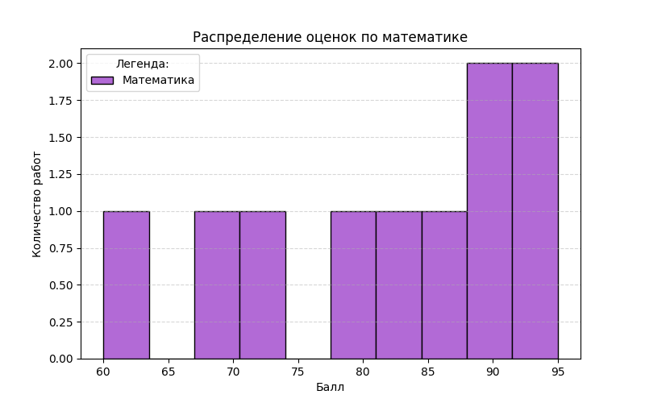
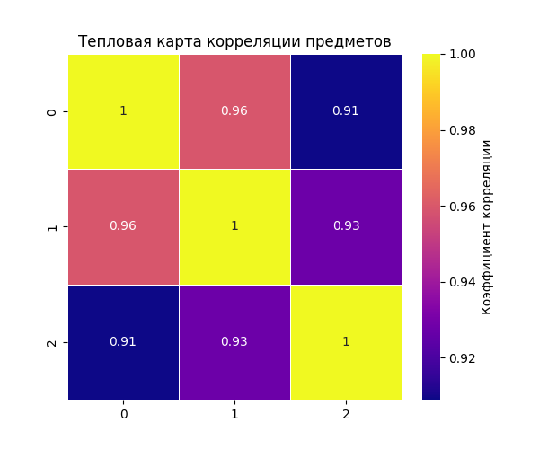
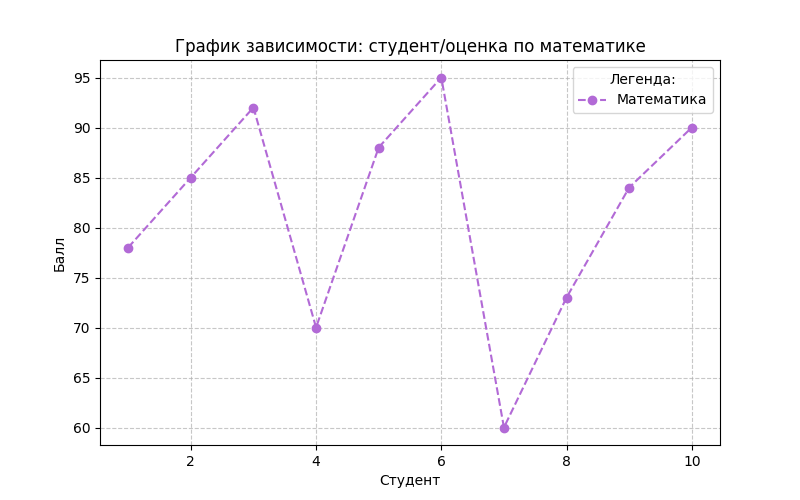
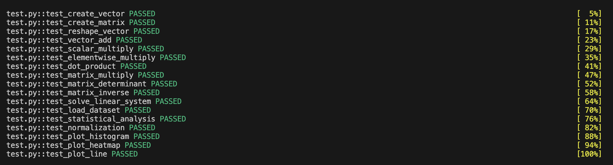

# Лабораторная работа 2: *Основы NumPy: массивы и векторные операции*

## Цели
1. Освоить практическое использование библиотеки `numpy` для работы с массивами и матрицами.
2. Изучить применение библиотеки `pandas` для загрузки и первичного анализа табличных данных.
3. Освоить построение графиков и визуализаций с помощью `matplotlib` и `seaborn`.
4. Закрепить навыки оформления Python-кода в соответствии с требованиями **PEP-8**, **PEP-257** и **PEP-484**.
5. Научиться проверять корректность решения с помощью автоматических тестов `pytest`.

## Задачи
В рамках лабораторной работы требовалось:

- Дополнить функции для создания и преобразования массивов, базовых операций над векторами, матричных вычислений так, чтобы они проходили необходимые тесты.
- Выполнить статистический анализ и реализовать нормализацию данных.
- Построить и сохранить графики различных типов.
- Проверить, что код аннотирован, содержит докстринг, соблюдает **PEP-8**.
- Проверить корректность решения при помощи тестов.

## Ход работы

### 1. Настройка виртуального окружения и установка зависимостей

Для выполнения лабораторной работы была подготовлена отдельная директория проекта, а также создано и активировано виртуальное окружение:
```bash
python -m venv numpy_env
```
```bash
source numpy_env/bin/activate
```
Далее были установлены необходимые зависимости:
```bash
pip install numpy matplotlib seaborn pandas pytest
```

??? info "Пояснение"
    Использованные библиотеки: numpy (работа с массивами, векторами и матрицами), pandas (загрузка и представление табличных данных), matplotlib (построение графиков), seaborn (создание тепловой карты), pytest (автоматическое тестирование), flake8 (проверка соответствия кода PEP-8).

### 2. Подготовка структуры проекта и входных данных
Внутри директории были размещены основной файл с реализацией функций (`main.py`), файл с тестами (`test.py`), каталог с исходными данными (`data/`) и каталог для сохранения графиков (`plots/`).

Итоговая структура проекта имеет следующий вид:

```bash
lab2/
├── main.py
├── test.py
├── data/
│   └── students_scores.csv
└── plots/
```

??? info "Пояснение"
    Выделение тестов в отдельный файл `test.py` делает структуру проекта более аккуратной и упрощает запуск автоматической проверки через `pytest`.

Для выполнения части лабораторной работы, связанной со статистическим анализом и визуализацией, в папке `data` был создан CSV-файл `students_scores.csv`, содержащий результаты студентов по нескольким дисциплинам:

```bash
math,physics,informatics
78,81,90
85,89,88
92,94,95
70,75,72
88,84,91
95,99,98
60,65,70
73,70,68
84,86,85
90,93,92
```
Данный файл использовался функцией загрузки набора данных и далее применялся для вычисления статистик и построения графиков.

### 3. Реализация функций для работы с массивами

На первом этапе были реализованы функции, отвечающие за создание и преобразование массивов средствами `numpy`.

| Функция | Назначение |
|--------|------------|
| `create_vector()` | Создание одномерного массива от 0 до 9 |
| `create_matrix()` | Создание матрицы размера 5×5 со случайными числами |
| `reshape_vector(vec)` | Преобразование массива формы `(10,)` в матрицу формы `(2, 5)` |
| `transpose_matrix(mat)` | Транспонирование матрицы |

Примеры реализаций:

```bash
def create_vector() -> np.ndarray:
    """
    Создать массив от 0 до 9.

    Returns:
        np.ndarray: Массив чисел от 0 до 9 включительно.
    """
    return np.arange(10)
```

```bash
def create_matrix() -> np.ndarray:
    """
    Создать матрицу 5x5 со случайными числами [0,1].

    Returns:
        np.ndarray: Матрица 5x5 со случайными значениями от 0 до 1.
    """
    return np.random.rand(5, 5)
```

```bash
def reshape_vector(vec: np.ndarray) -> np.ndarray:
    """
    Преобразовать вектор формы (10,) в матрицу формы (2, 5).

    Args:
        vec (np.ndarray): Входной массив формы (10,).

    Returns:
        np.ndarray: Преобразованный массив формы (2, 5).
    """
    return vec.reshape(2, 5)
```

```bash
def transpose_matrix(mat: np.ndarray) -> np.ndarray:
    """
    Транспонировать матрицу.

    Args:
        mat (np.ndarray): Входная матрица.

    Returns:
        np.ndarray: Транспонированная матрица.
    """
    return mat.T
```

### 4. Реализация векторных операций

Следующим этапом были реализованы функции для работы с векторами, отвечающие за следующие операции:

| Функция | Назначение |
|--------|------------|
| `vector_add(a, b)` | Поэлементное сложение двух векторов |
| `scalar_multiply(vec, scalar)` | Умножение вектора на скаляр |
| `elementwise_multiply(a, b)` | Поэлементное умножение |
| `dot_product(a, b)` | Вычисление скалярного произведения |

Примеры реализаций:

```bash
def vector_add(a: np.ndarray, b: np.ndarray) -> np.ndarray:
    """
    Сложить два вектора одинаковой длины.

    Args:
        a (np.ndarray): Первый вектор.
        b (np.ndarray): Второй вектор.

    Returns:
        np.ndarray: Результат поэлементного сложения.
    """
    return a + b
```

```bash
def scalar_multiply(vec: np.ndarray, scalar: float) -> np.ndarray:
    """
    Умножить вектор на скаляр.

    Args:
        vec (np.ndarray): Входной вектор.
        scalar (float): Число для умножения.

    Returns:
        np.ndarray: Результат умножения вектора на скаляр.
    """
    return vec * scalar
```

```bash
def elementwise_multiply(a: np.ndarray, b: np.ndarray) -> np.ndarray:
    """
    Выполнить поэлементное умножение.

    Args:
        a (np.ndarray): Первый вектор/матрица.
        b (np.ndarray): Второй вектор/матрица.

    Returns:
        np.ndarray: Результат поэлементного умножения.
    """
    return a * b
```

```bash
def dot_product(a: np.ndarray, b: np.ndarray) -> float:
    """
    Вычислить скалярное произведение двух векторов.

    Args:
        a (np.ndarray): Первый вектор.
        b (np.ndarray): Второй вектор.

    Returns:
        float: Скалярное произведение векторов.
    """
    return float(np.dot(a, b))
```

### 5. Реализация матричных вычислений

После работы с векторами были реализованы функции для выполнения базовых матричных операций.

| Функция | Назначение |
|--------|------------|
| `matrix_multiply(a, b)` | Умножение двух матриц |
| `matrix_determinant(a)` | Вычисление определителя матрицы |
| `matrix_inverse(a)` | Нахождение обратной матрицы |
| `solve_linear_system(a, b)` | Решение системы линейных уравнений `Ax = b` |

Примеры реализаций:

```bash
def matrix_multiply(a: np.ndarray, b: np.ndarray) -> np.ndarray:
    """
    Умножить две матрицы.

    Args:
        a (np.ndarray): Первая матрица.
        b (np.ndarray): Вторая матрица.

    Returns:
        np.ndarray: Результат умножения матриц.
    """
    return a @ b
```

```bash
def matrix_determinant(a: np.ndarray) -> float:
    """
    Вычислить определитель матрицы.

    Args:
        a (np.ndarray): Квадратная матрица.

    Returns:
        float: Определитель матрицы.
    """
    return float(np.linalg.det(a))
```

```bash
def matrix_inverse(a: np.ndarray) -> np.ndarray:
    """
    Найти обратную матрицу.

    Args:
        a (np.ndarray): Квадратная матрица.

    Returns:
        np.ndarray: Обратная матрица.
    """
    return np.linalg.inv(a)
```

```bash
def solve_linear_system(a: np.ndarray, b: np.ndarray) -> np.ndarray:
    """
    Решить систему линейных уравнений Ax = b.

    Args:
        a (np.ndarray): Матрица коэффициентов.
        b (np.ndarray): Вектор свободных членов.

    Returns:
        np.ndarray: Решение системы.
    """
    return np.linalg.solve(a, b)
```

??? info "Примечание"
    Для вычисления обратной матрицы и определителя матрица должна быть квадратной, а обратимая матрица должна иметь ненулевой определитель.
    В тестах использовались корректные входные данные, удовлетворяющие этим условиям.

### 6. Загрузка, анализ и нормализация набора данных

Для работы с CSV-файлом была реализована функция загрузки данных через библиотеку `pandas`.
После чтения таблицы данные преобразовывались в формат `numpy.ndarray`, поскольку дальнейшие вычисления выполнялись средствами `numpy`. Затем была реализована функция статистического анализа данных. Отдельной задачей лабораторной работы была реализация Min-Max нормализации, при которой значения массива приводятся к диапазону от 0 до 1. 

| Функция | Назначение |
|--------|------------|
| `load_dataset(path)` | Загрузка CSV-файла и преобразование данных в `numpy.ndarray` |
| `statistical_analysis(data)` | Вычисление основных статистических характеристик |
| `normalize_data(data)` | Min-Max нормализация массива |

```bash
def load_dataset(path: str = "data/students_scores.csv") -> np.ndarray:
    """
    Загрузить CSV-файл и вернуть данные в виде NumPy-массива.

    Args:
        path (str): Путь к CSV-файлу.

    Returns:
        np.ndarray: Загруженные данные.
    """
    return pd.read_csv(path).to_numpy()
```

```bash
def statistical_analysis(data: np.ndarray) -> dict[str, float]:
    """
    Вычислить основные статистические показатели для массива данных.

    Args:
        data (np.ndarray): Одномерный массив данных.

    Returns:
        dict[str, float]: Словарь со статистическими показателями.
    """
    return {
        "mean": float(np.mean(data)),
        "median": float(np.median(data)),
        "std": float(np.std(data)),
        "min": float(np.min(data)),
        "max": float(np.max(data)),
        "percentile_25": float(np.percentile(data, 25)),
        "percentile_75": float(np.percentile(data, 75)),
    }
```

Нормализация выполнялась по следующей формуле:

```bash
(x - min) / (max - min)
```

Реализация функции:

```bash
def normalize_data(data: np.ndarray) -> np.ndarray:
    """
    Выполнить Min-Max нормализацию данных.

    Формула:
        (x - min) / (max - min)

    Args:
        data (np.ndarray): Входной массив данных.

    Returns:
        np.ndarray: Нормализованный массив в диапазоне [0, 1].
    """
    min_value = np.min(data)
    max_value = np.max(data)
    return (data - min_value) / (max_value - min_value)
```

??? info "Примечание"
    Данный метод корректно работает в случае, если мин и макс значения различаются, тк если все элементы массива одинаковы, возникает деление на ноль. В рамках ЛР тесты были составлены для корректных данных.

### 7. Построение и сохранение графиков

Были релизованы функции для построения и сохранения трёх типов графиков:

| Функция | Назначение |
|--------|------------|
| `plot_histogram(data)` | Построение и сохранение гистограммы |
| `plot_heatmap(matrix)` | Построение и сохранение тепловой карты |
| `plot_line(x, y)` | Построение и сохранение линейного графика |

Примеры реализаций:

```bash
def plot_histogram(data: np.ndarray) -> None:
    """
    Построить гистограмму и сохранить её в папку plots.

    Args:
        data (np.ndarray): Данные для построения гистограммы.
    """
    os.makedirs("plots", exist_ok=True)

    plt.figure(figsize=(8, 5))
    plt.hist(data, bins=10, edgecolor="black")
    plt.title("Histogram of Math Scores")
    plt.xlabel("Score")
    plt.ylabel("Frequency")
    plt.grid(axis="y", linestyle="--", alpha=0.7)
    plt.savefig("plots/histogram.png")
    plt.close()
```
**Итоговый график:**



```bash
def plot_heatmap(matrix: np.ndarray) -> None:
    """
    Построить тепловую карту и сохранить её в папку plots.

    Args:
        matrix (np.ndarray): Матрица для визуализации.
    """
    os.makedirs("plots", exist_ok=True)

    plt.figure(figsize=(6, 5))
    sns.heatmap(matrix, annot=True, cmap="coolwarm", linewidths=0.5)
    plt.title("Heatmap")
    plt.savefig("plots/heatmap.png")
    plt.close()
```
**Итоговый график:**



```bash
def plot_line(x: np.ndarray, y: np.ndarray) -> None:
    """
    Построить линейный график и сохранить его в папку plots.

    Args:
        x (np.ndarray): Значения по оси X.
        y (np.ndarray): Значения по оси Y.
    """
    os.makedirs("plots", exist_ok=True)

    plt.figure(figsize=(8, 5))
    plt.plot(x, y, marker="o")
    plt.title("Student Scores in Math")
    plt.xlabel("Student")
    plt.ylabel("Score")
    plt.grid(True, linestyle="--", alpha=0.7)
    plt.savefig("plots/line.png")
    plt.close()
```
**Итоговый график:**



### 8. Аннотации типов и документация

Все реализованные функции были дополнены аннотациями типов. 

Примеры:

```bash
def create_vector() -> np.ndarray:
def create_matrix() -> np.ndarray:
def reshape_vector(vec: np.ndarray) -> np.ndarray:
def transpose_matrix(mat: np.ndarray) -> np.ndarray:
def vector_add(a: np.ndarray, b: np.ndarray) -> np.ndarray:
def scalar_multiply(vec: np.ndarray, scalar: float) -> np.ndarray:
def elementwise_multiply(a: np.ndarray, b: np.ndarray) -> np.ndarray:
def dot_product(a: np.ndarray, b: np.ndarray) -> float:
def matrix_multiply(a: np.ndarray, b: np.ndarray) -> np.ndarray:
def matrix_determinant(a: np.ndarray) -> float:
def matrix_inverse(a: np.ndarray) -> np.ndarray:
def solve_linear_system(a: np.ndarray, b: np.ndarray) -> np.ndarray:
def load_dataset(path: str = "data/students_scores.csv") -> np.ndarray:
def statistical_analysis(data: np.ndarray) -> dict[str, float]:
def normalize_data(data: np.ndarray) -> np.ndarray:
def plot_histogram(data: np.ndarray) -> None:
def plot_heatmap(matrix: np.ndarray) -> None:
def plot_line(x: np.ndarray, y: np.ndarray) -> None:
```

Также каждая функция была снабжена docstring, содержащим краткое описание назначения функции, описание аргументов и описание возвращаемого значения.

### 9. Проверка кода и тестирование

Для проверки корректности лабораторной работы использовались автоматические тесты `pytest`.
После реализации всех функций тесты были вынесены в отдельный файл `test.py`, а затем успешно выполнены.

Запуск тестов:

```bash
python3 -m pytest test.py -v
```

Результат выполнения тестов:




Кроме того, код был проверен на соответствие стилевым требованиям **PEP-8** с помощью `flake8`:

```bash
flake8 main.py
```
После исправления замечаний код успешно прошёл эту проверку.

## Выводы

В ходе выполнения лабораторной работы были освоены базовые возможности библиотек `numpy`, `pandas`, `matplotlib` и `seaborn` для решения типовых задач анализа данных.

В рамках ЛР были реализованы функции для:

- Создания и преобразования массивов
- Выполнения векторных и матричных вычислений
- Загрузки и обработки табличных данных
- Вычисления статистических характеристик
- Нормализации данных
- Визуализации результатов

Дополнительно код был приведён к требованиям **PEP-8**, **PEP-257** и **PEP-484**, а его корректность подтверждена автоматическими тестами `pytest`.