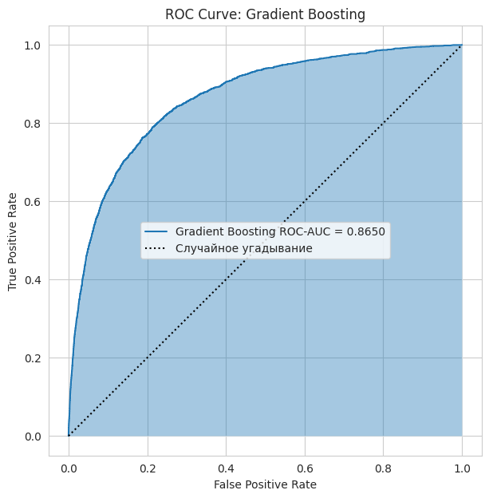

# Лабораторная работа 4: *Классификация с применением Scikit-Learn*

## Цели

1. Изучить применение библиотеки **Scikit-Learn** для решения задачи классификации.
2. Освоить базовые этапы построения модели машинного обучения: предобработку данных, обучение и оценку качества классификатора.
3. Исследовать различные алгоритмы классификации на задаче предсказания кредитного дефолта.

## Задачи

В рамках лабораторной работы требовалось:

- Загрузить и предобработать обучающие и тестовые данные
- Обучить модели классификации с помощью **Scikit-Learn**
- Оценить качество моделей с использованием `accuracy`, `confusion matrix` и `ROC-AUC`
- Исследовать влияние порога классификации на результаты модели
- Построить ROC-кривые классификаторов
- Исследовать дополнительные алгоритмы классификации и сравнить их качество
- Проанализировать современные методы кредитного скоринга
- Рассмотреть способы интеграции ML-модели в веб-приложение

## Ход работы
### 1. Загрузка и анализ данных
В качестве исходных данных использовался датасет Kaggle **Give Me Some Credit**, посвящённый задаче предсказания кредитного дефолта.

Для загрузки обучающей и тестовой выборок использовалась библиотека `pandas`:

```bash
training_data = pd.read_csv('training_data.csv')

test_data = pd.read_csv('test_data.csv')
```

После загрузки была выполнена проверка структуры данных с помощью метода `info()`.
В ходе анализа были обнаружены пропущенные значения в признаках `MonthlyIncome` и `NumberOfDependents`, а также выявлен дисбаланс классов целевой переменной.

### 2. Предобработка данных

Для обработки пропусков были вычислены средние значения признаков обучающей выборки:

```bash
train_mean = training_data.mean()
```

После этого пропущенные значения были заполнены с помощью метода `fillna()`:

```bash
training_data.fillna(train_mean, inplace=True)
test_data.fillna(train_mean, inplace=True)
```

Далее данные были разделены на входные признаки и целевую переменную:

```bash
training_values = training_data[target_variable_name]
training_points = training_data.drop(columns=[target_variable_name])
```

### 3. Обучение моделей классификации

В качестве базовых моделей были выбраны:

- `Logistic Regression`
- `Random Forest Classifier`

Модели были созданы и обучены с помощью библиотеки **Scikit-Learn**:

```bash
logistic_regression_model = linear_model.LogisticRegression()

random_forest_model = ensemble.RandomForestClassifier(
    n_estimators=100
)

logistic_regression_model.fit(training_points, training_values)
random_forest_model.fit(training_points, training_values)
```

Логистическая регрессия использовалась как базовая модель классификации, а `Random Forest` - как ансамблевый алгоритм для поиска более сложных зависимостей между признаками.

### 4. Оценка качества моделей

Для оценки качества классификации были получены предсказания моделей на тестовой выборке:

```bash
test_predictions_logistic_regression = logistic_regression_model.predict(test_points)

test_predictions_random_forest = random_forest_model.predict(test_points)
```

Для анализа качества использовались метрики:

* `accuracy`
* `confusion matrix`
* `ROC-AUC`

Дополнительно была построена `confusion matrix`, позволяющая оценить количество верных и ошибочных предсказаний каждого класса.

### 5. Анализ порога классификации и ROC-AUC

Помимо предсказания классов, модели могут выдавать вероятность принадлежности объекта к классу дефолта. Для этого использовался метод `predict_proba()`:

```bash
test_probabilities = logistic_regression_model.predict_proba(test_points)
test_probabilities = test_probabilities[:, 1]
```

Было исследовано влияние порога классификации на результат модели. При понижении порога модель чаще предсказывает дефолт, а при повышении — реже относит клиентов к проблемным.

Также была рассчитана метрика `ROC-AUC`:

```bash
roc_auc_value = roc_auc_score(test_values, test_probabilities)
```

`ROC-AUC` использовалась как более информативная метрика для задачи с дисбалансом классов.

### 6. Исследование дополнительных моделей

В рамках самостоятельной работы были исследованы дополнительные алгоритмы классификации:

- k-Nearest Neighbors (`kNN`)
- Support Vector Machine (`SVM`)
- `Gradient Boosting`
- `HistGradientBoostingClassifier`

Для моделей `kNN` и `SVM` применялась стандартизация признаков с помощью `StandardScaler`, поскольку данные алгоритмы чувствительны к масштабу входных данных.

Пример создания модели `kNN`:

```bash
knn_model = make_pipeline(
    StandardScaler(),
    KNeighborsClassifier(n_neighbors=15)
)
```

Качество моделей сравнивалось с помощью метрики `ROC-AUC`.

??? info "Пояснение"
    Почему использовалась ROC-AUC: в задаче кредитного скоринга наблюдается выраженный дисбаланс классов - клиентов без дефолта значительно больше, чем клиентов с просрочкой. По этой причине accuracy не всегда объективно отражает качество модели.
    Метрика ROC-AUC позволяет более корректно оценивать способность модели различать классы при изменении порога классификации.

Итоговые результаты сравнения моделей:

| Модель | ROC-AUC |
|---|---|
| Gradient Boosting | 0.864968 |
| HistGradientBoosting | 0.863617 |
| Random Forest | 0.840026 |
| kNN | 0.718918 |
| Logistic Regression | 0.661806 |
| SVM | 0.660802 |

Наилучшее качество показали ансамблевые методы бустинга — Gradient Boosting и HistGradientBoostingClassifier. Они значительно превзошли Logistic Regression, SVM и kNN по метрике ROC-AUC.

Ниже представлен график ROC-кривой для модели с наилучшим значением `ROC-AUC`:



В ходе исследования было установлено, что ансамблевые методы бустинга наиболее эффективно работают с табличными данными кредитного скоринга.
`kNN` показал средний результат, а `Logistic Regression` и `SVM` продемонстрировали более низкое качество классификации на рассматриваемом наборе данных.

## Выводы

В ходе выполнения лабораторной работы были изучены методы классификации в библиотеке **Scikit-Learn** и рассмотрена задача предсказания кредитного дефолта.

Были реализованы основные этапы работы с ML-моделью:

- предобработка данных
- обучение классификаторов
- оценка качества моделей
- анализ ROC-кривых и `confusion matrix`

На практике было показано, что `accuracy` не всегда является достаточной метрикой при дисбалансе классов, поэтому для оценки качества дополнительно использовались `ROC-AUC` и `confusion matrix`.

Также были исследованы дополнительные модели классификации. Наилучшие результаты показали ансамблевые методы бустинга, которые оказались наиболее эффективными для табличных данных кредитного скоринга.

Ссылка на доску Colab:

[Доска Colab](https://colab.research.google.com/drive/1X2AzoRecYvMjKkjGY9kyzfliBBYqU4Y-?usp=sharing)