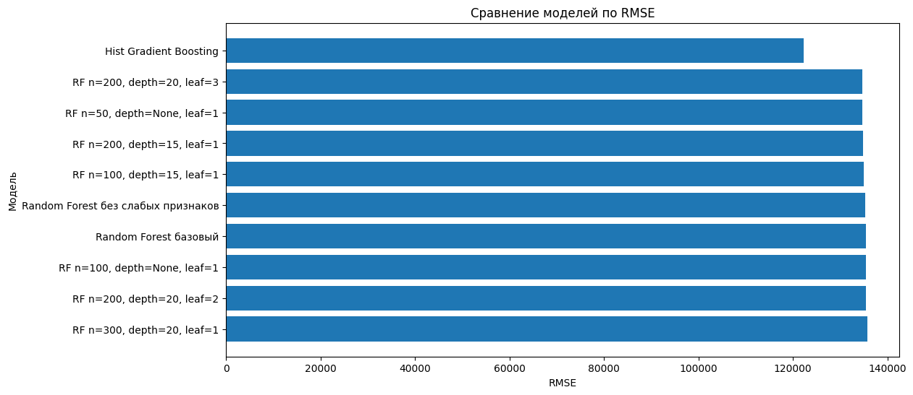

# Лабораторная работа 5: *Регрессия с применением Scikit-Learn*

## Цели

1. Изучить применение библиотеки **Scikit-Learn** для решения задачи регрессии.
2. Освоить базовые этапы построения модели машинного обучения для предсказания числового значения.
3. Исследовать качество разных моделей регрессии на задаче предсказания стоимости недвижимости.
4. Сравнить влияние отбора признаков, настройки гиперпараметров и выбора алгоритма на итоговую ошибку модели.

## Задачи

В рамках лабораторной работы требовалось:

- Загрузить и проанализировать данные о стоимости недвижимости, разделить данные на признаки и целевую переменную
- Обучить модели регрессии с помощью **Scikit-Learn**
- Оценить качество моделей с использованием метрик `MAE`, `MSE` и `RMSE`
- Проанализировать важность признаков и исключить наименее значимые признаки, затем проверить изменение качества моделей
- Исследовать параметры модели `RandomForestRegressor`
- Проверить дополнительные модели регрессии и сравнить их с базовыми моделями
- Рассмотреть способ интеграции обученной ML-модели в веб-приложение на Flask, Django или FastAPI

## Ход работы

### 1. Загрузка и анализ данных

В качестве исходных данных использовался датасет с информацией о недвижимости в округе Кинг, штат Вашингтон, США.  
Целью задачи являлось предсказание стоимости дома на основе его характеристик.

Загрузка обучающей выборки выполнялась с помощью функции `read_excel()`. После загрузки была выполнена проверка первых строк таблицы, а также был проверен размер обучающей выборки.

Для получения общей информации о данных использовался метод `info()`.

### 2. Разделение данных на признаки и целевую переменную

Значения целевой переменной (цена недвижимости) были вынесены в отдельную переменную:

```bash
training_values = training_data[target_variable_name]
```

После этого из обучающей таблицы был удален столбец с ценой, чтобы получить таблицу входных признаков:

```bash
training_points = training_data.drop(target_variable_name, axis=1)
```

Таким образом, были получены:

* `training_values` — настоящие значения цен домов
* `training_points` — признаки, по которым модель должна предсказывать цену

### 3. Обучение базовых моделей регрессии

В качестве базовых моделей были рассмотрены:

* `LinearRegression`
* `RandomForestRegressor`

Тестовая выборка была загружена аналогично обучающей:

```bash
test_data = pd.read_excel('predict_house_price_test_data.xlsx')
```

Целевая переменная была отделена от входных признаков:

```bash
test_values = test_data[target_variable_name]
test_points = test_data.drop(target_variable_name, axis=1)
```

В результате были получены:

* `test_values` — настоящие цены объектов недвижимости из тестовой выборки
* `test_points` — признаки объектов недвижимости из тестовой выборки

Для получения предсказаний использовался метод `predict()`:

```bash
test_predictions_linear = linear_regression_model.predict(test_points)
test_predictions_random_forest = random_forest_model.predict(test_points)
```

Качество моделей оценивалось с помощью метрик регрессии:

* MAE
* MSE
* RMSE

Для расчета метрик использовались функции из `sklearn.metrics`.

Расчет ошибок для линейной регрессии:

```bash
mean_absolute_error_linear_model = mean_absolute_error(
    test_values,
    test_predictions_linear
)
mean_squared_error_linear_model = mean_squared_error(
    test_values,
    test_predictions_linear
)
```

Расчет ошибок для случайного леса:

```bash
mean_absolute_error_random_forest_model = mean_absolute_error(
    test_values,
    test_predictions_random_forest
)
mean_squared_error_random_forest_model = mean_squared_error(
    test_values,
    test_predictions_random_forest
)
```

??? info "Пояснение"
    MAE показывает среднюю абсолютную ошибку модели.
    MSE показывает среднюю квадратичную ошибку и сильнее штрафует большие отклонения.
    RMSE — корень из MSE. Эта метрика удобна для интерпретации, потому что измеряется в тех же единицах, что и целевая переменная, то есть в долларах.

Результаты базовых моделей:

| Модель | MAE | MSE | RMSE |
|---|---:|---:|---:|
| Linear Regression | 126852.51 | 40756840000 | 201883.24 |
| Random Forest базовый | 70896.79 | 18364750000 | 135516.61 |

По результатам сравнения видно, что модель случайного леса справилась с задачей значительно лучше линейной регрессии.
Значение RMSE у `RandomForestRegressor` оказалось меньше, чем у `LinearRegression`, поэтому случайный лес был выбран как более сильная базовая модель для дальнейших экспериментов.

### 4. Анализ важности признаков

Для анализа влияния признаков на результат была использована модель `RandomForestRegressor`.
У обученной модели была получена оценка важности признаков:

```bash
random_forest_model.feature_importances_
```

Для удобного представления результатов была создана таблица:

```bash
feature_importance = pd.DataFrame(columns=[
    'Название признака',
    'Важность признака'
])
feature_importance['Название признака'] = training_points.keys()
feature_importance['Важность признака'] = random_forest_model.feature_importances_
```

Затем признаки были отсортированы по убыванию важности:

```bash
feature_importance.sort_values(
    by='Важность признака',
    ascending=False
)
```

Наиболее значимыми признаками оказались:

1. Оценка риелтора
2. Жилая площадь
3. Широта
4. Долгота
5. Год постройки

Наименее значимыми признаками оказались:

1. Год реновации
2. Количество этажей
3. Спальни
4. Состояние
5. Площадь подвала

### 5. Исключение наименее значимых признаков

В рамках самостоятельной части были исключены пять признаков с наименьшей важностью:

```bash
low_importance_features = [
    'Год реновации',
    'Количество этажей',
    'Спальни',
    'Состояние',
    'Площадь подвала'
]
```

После этого были сформированы новые обучающая и тестовая выборки:

```bash
training_points_reduced = training_points.drop(
    low_importance_features,
    axis=1
)
test_points_reduced = test_points.drop(
    low_importance_features,
    axis=1
)
```

На сокращенном наборе признаков были повторно обучены модели линейной регрессии и случайного леса.

Результаты сравнения:

| Модель | MAE | MSE | RMSE |
|---|---:|---:|---:|
| Linear Regression | 126852.51 | 40756840000 | 201883.24 |
| Linear Regression без слабых признаков | 128146.14 | 41484850000 | 203678.30 |
| Random Forest базовый | 70896.79 | 18364750000 | 135516.61 |
| Random Forest без слабых признаков | 71150.49 | 18301270000 | 135282.18 |

После исключения слабых признаков качество модели `RandomForestRegressor` немного улучшилось: RMSE уменьшилось с 135516.61 до 135282.18.
Однако для линейной регрессии результат ухудшился: RMSE выросло с 201883.24 до 203678.30.

### 6. Исследование параметров Random Forest

Далее были исследованы параметры модели `RandomForestRegressor`.

Рассматривались следующие параметры:

* `n_estimators` — количество деревьев в лесу
* `max_depth` — максимальная глубина дерева
* `min_samples_leaf` — минимальное количество объектов в листе

Пример создания модели с заданными параметрами:

```bash
model = ensemble.RandomForestRegressor(
    n_estimators=200,
    max_depth=20,
    min_samples_leaf=3,
    random_state=42,
    n_jobs=-1
)
```

Параметр `n_jobs`=-1 использовался для ускорения обучения модели за счет использования всех доступных ядер процессора.

Были проверены разные комбинации параметров. Лучшие результаты среди вариантов случайного леса:

| Модель | MAE | MSE | RMSE |
|---|---:|---:|---:|
| RF n=200, depth=20, leaf=3 | 70596.74 | 18125590000 | 134631.32 |
| RF n=50, depth=None, leaf=1 | 71272.34 | 18143060000 | 134696.19 |
| RF n=200, depth=15, leaf=1 | 70925.67 | 18191330000 | 134875.23 |
| RF n=100, depth=15, leaf=1 | 71211.92 | 18235830000 | 135040.11 |
| Random Forest базовый | 70896.79 | 18364750000 | 135516.61 |

Лучший результат среди моделей `Random Forest` показала модель со следующими параметрами:

* `n_estimators` = 200
* `max_depth` = 20
* `min_samples_leaf` = 3

Для этой модели значение RMSE составило 134631.32, тогда как у базового случайного леса RMSE было равно 135516.61.

### 7. Исследование дополнительных моделей регрессии

Кроме линейной регрессии и случайного леса были рассмотрены дополнительные модели регрессии:

* `DecisionTreeRegressor`
* `ExtraTreesRegressor`
* `GradientBoostingRegressor`
* `HistGradientBoostingRegressor`

Пример списка моделей для эксперимента:

```bash
other_models = [
    (
        'Decision Tree',
        DecisionTreeRegressor(random_state=42)
    ),
    (
        'Extra Trees',
        ExtraTreesRegressor(
            n_estimators=200,
            random_state=42,
            n_jobs=-1
        )
    ),
    (
        'Gradient Boosting',
        GradientBoostingRegressor(
            n_estimators=200,
            learning_rate=0.05,
            max_depth=3,
            random_state=42
        )
    ),
    (
        'Hist Gradient Boosting',
        HistGradientBoostingRegressor(
            max_iter=300,
            learning_rate=0.05,
            max_leaf_nodes=31,
            random_state=42
        )
    )
]
```

Для оценки моделей была написана вспомогательная функция:

```bash
def evaluate_model(model, train_X, train_y, test_X, test_y, model_name):
    model.fit(train_X, train_y)
    predictions = model.predict(test_X)
    mae = mean_absolute_error(test_y, predictions)
    mse = mean_squared_error(test_y, predictions)
    rmse = np.sqrt(mse)
    return {
        'Модель': model_name,
        'MAE': mae,
        'MSE': mse,
        'RMSE': rmse
    }
```

Итоговые результаты сравнения моделей:

| Модель | MAE | MSE | RMSE |
|---|---:|---:|---:|
| Hist Gradient Boosting | 67889.44 | 14969960000 | 122351.79 |
| RF n=200, depth=20, leaf=3 | 70596.74 | 18125590000 | 134631.32 |
| RF n=50, depth=None, leaf=1 | 71272.34 | 18143060000 | 134696.19 |
| RF n=200, depth=15, leaf=1 | 70925.67 | 18191330000 | 134875.23 |
| RF n=100, depth=15, leaf=1 | 71211.92 | 18235830000 | 135040.11 |
| Random Forest без слабых признаков | 71150.49 | 18301270000 | 135282.18 |
| Random Forest базовый | 70896.79 | 18364750000 | 135516.61 |
| Extra Trees | 72038.26 | 19086620000 | 138154.32 |
| Gradient Boosting | 78886.73 | 19215750000 | 138620.87 |
| Decision Tree | 102076.31 | 40123210000 | 200307.79 |
| Linear Regression | 126852.51 | 40756840000 | 201883.24 |
| Linear Regression без слабых признаков | 128146.14 | 41484850000 | 203678.30 |

Для наглядного сравнения моделей был построен график значений `RMSE`:



Наилучшее качество показала модель `HistGradientBoostingRegressor`.

Ее результат:

| Метрика | Значение |
|---|---:|
| MAE | 67889.44 |
| MSE | 14969960000 |
| RMSE | 122351.79 |

Базовый `RandomForestRegressor` имел значение RMSE = 135516.61.

Улучшение по RMSE составило:

135516.61 - 122351.79 = 13164.82

В процентном выражении ошибка уменьшилась примерно на 9.72%.

### 8. Интеграция обученной модели в веб-приложение

Обученную модель машинного обучения можно интегрировать в веб-приложение, реализованное с помощью **Flask**, **Django** или **FastAPI**.

Пример интеграции с **FastAPI**:

```bash
from fastapi import FastAPI
from pydantic import BaseModel
import joblib
import pandas as pd
app = FastAPI()
model = joblib.load('house_price_model.pkl')
class HouseFeatures(BaseModel):
    bedrooms: int
    bathrooms: float
    living_area: float
    total_area: float
    floors: float
    waterfront: int
    viewed: int
    condition: int
    grade: int
    area_without_basement: float
    basement_area: float
    year_built: int
    year_renovated: int
    latitude: float
    longitude: float
@app.post('/predict')
def predict_price(features: HouseFeatures):
    input_data = pd.DataFrame([{
        'Спальни': features.bedrooms,
        'Ванные': features.bathrooms,
        'Жилая площадь': features.living_area,
        'Общая площадь': features.total_area,
        'Количество этажей': features.floors,
        'Вид на воду': features.waterfront,
        'Просмотрены ранее': features.viewed,
        'Состояние': features.condition,
        'Оценка риелтора': features.grade,
        'Площадь без подвала': features.area_without_basement,
        'Площадь подвала': features.basement_area,
        'Год постройки': features.year_built,
        'Год реновации': features.year_renovated,
        'Широта': features.latitude,
        'Долгота': features.longitude
    }])
    prediction = model.predict(input_data)[0]
    return {
        'predicted_price': prediction
    }
```

В случае **Flask** логика будет похожей: пользователь отправляет данные через HTML-форму или POST-запрос, сервер преобразует их в таблицу `pandas.DataFrame`, передает в модель и возвращает предсказанную цену.

В случае **Django** модель можно подключить во `view`-функции или `class-based view`. Пользователь заполняет форму, данные проходят валидацию, после чего передаются в ML-модель. Результат можно отобразить на HTML-странице.

??? info "Пояснение"
    Важно, чтобы признаки, которые приходят в веб-приложение, имели тот же порядок, те же названия и тот же формат, что и признаки, использованные при обучении модели.
    Если при обучении выполнялась дополнительная предобработка данных, ее также нужно сохранить и использовать в веб-приложении.

## Выводы

В ходе выполнения лабораторной работы была изучена задача регрессии на примере предсказания стоимости недвижимости.

Были выполнены основные этапы работы с ML-моделью:

* загрузка данных
* анализ структуры данных
* разделение данных на признаки и целевую переменную
* обучение моделей регрессии
* получение предсказаний на тестовой выборке
* оценка качества моделей с помощью MAE, MSE и RMSE
* анализ важности признаков
* настройка параметров модели
* сравнение нескольких алгоритмов машинного обучения

Базовая модель линейной регрессии показала худший результат среди основных моделей: ее RMSE составило 201883.24.

Модель случайного леса справилась с задачей значительно лучше: базовый `RandomForestRegressor` показал RMSE = 135516.61.

После настройки параметров случайного леса удалось немного улучшить результат. Лучший вариант `RandomForestRegressor` имел параметры `n_estimators` = 200, `max_depth` = 20, `min_samples_leaf` = 3 и показал RMSE = 134631.32.

Наилучший результат среди всех рассмотренных моделей показала модель `HistGradientBoostingRegressor`. Ее значение RMSE составило 122351.79, что примерно на 9.72% лучше результата базового случайного леса.

Также была рассмотрена возможность интеграции обученной модели в веб-приложение. Был описан общий алгоритм интеграции модели с **Flask**, **Django** или **FastAPI**.

**Ссылка на доску Colab:**

[Доска Colab](https://colab.research.google.com/drive/1upkKMsBf1mXHOtvPoaw_OiF2IqYyd6hT?usp=sharing)