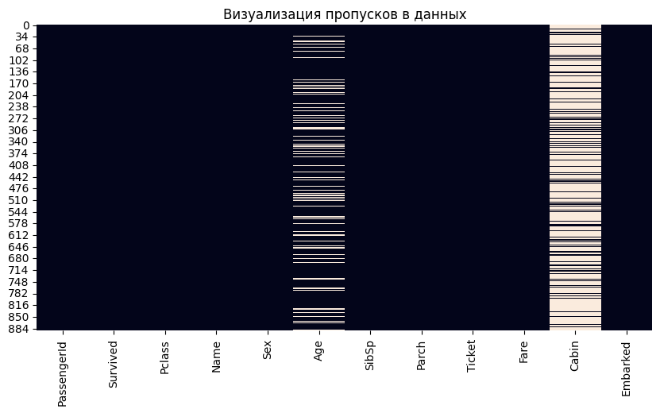
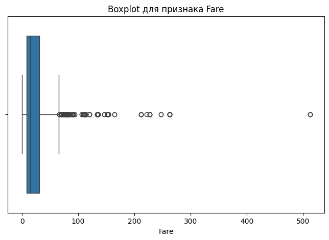
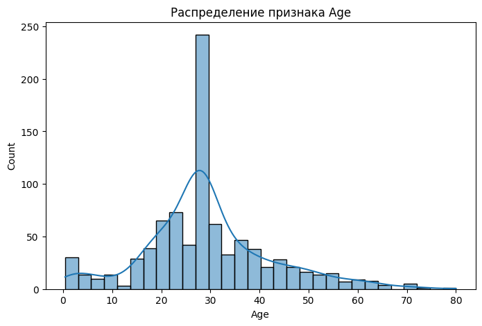
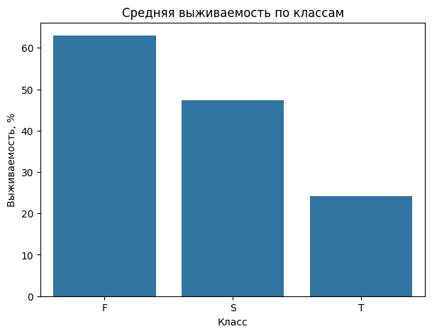
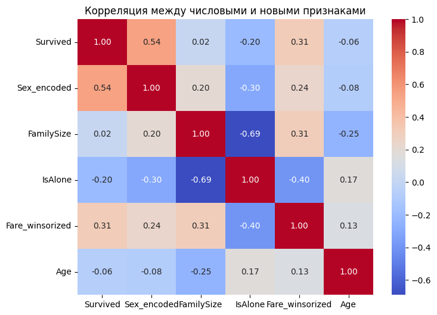

# Лабораторная работа 6: *Очистка и трансформация данных. pandas*

## Цели

1. Освоить основные методы очистки данных с использованием библиотеки **pandas**.
2. Изучить способы обработки пропущенных значений, выбросов и категориальных признаков.
3. Научиться выполнять трансформацию данных и создавать новые признаки на основе существующих.
4. Провести первичный анализ реального набора данных и подготовить его к дальнейшему использованию.

## Задачи

В рамках лабораторной работы требовалось:

- загрузить данные из CSV-файла
- выполнить первичный анализ датафрейма
- определить типы данных и количество пропусков
- получить статистические характеристики числовых и категориальных признаков
- построить визуализации распределений и пропущенных значений
- обработать пропуски в столбцах `Age`, `Embarked` и `Cabin`
- преобразовать типы данных и создать новые признаки
- выявить выбросы с помощью IQR-метода
- применить winsorization для обработки экстремальных значений
- выполнить агрегацию данных и построить сводные таблицы
- вычислить метрики качества очистки данных
- сохранить очищенный датафрейм в новый CSV-файл

## Ход работы

### 1. Описание набора данных

В качестве исходных данных использовался датасет **Titanic** с платформы Kaggle. Набор данных содержит информацию о пассажирах корабля Titanic и используется для анализа факторов, связанных с выживаемостью пассажиров.

В работе использовался файл `train.csv`, так как он содержит целевой признак `Survived`, показывающий, выжил пассажир или нет.

Структура данных:

| Признак | Описание |
|---|---|
| `PassengerId` | идентификатор пассажира |
| `Survived` | факт выживания: `0` — не выжил, `1` — выжил |
| `Pclass` | класс билета |
| `Name` | имя пассажира |
| `Sex` | пол пассажира |
| `Age` | возраст пассажира |
| `SibSp` | количество братьев, сестер или супругов на борту |
| `Parch` | количество родителей или детей на борту |
| `Ticket` | номер билета |
| `Fare` | стоимость билета |
| `Cabin` | номер каюты |
| `Embarked` | порт посадки |

Для загрузки данных использовалась библиотека `pandas`:

```bash
df = pd.read_csv("train.csv")
```

После загрузки были выведены первые 10 строк датафрейма:

```bash
df.head(10)
```

Исходный датафрейм содержит 891 строку и 12 столбцов:

```bash
df.shape
```

Результат:

| Количество строк | Количество столбцов |
|---:|---:|
| 891 | 12 |

### 2. Первичный анализ данных

На первом этапе была выполнена проверка структуры датафрейма с помощью метода `info()`:

```bash
df.info()
```

В результате были получены следующие типы данных:

| Столбец | Тип данных | Количество непустых значений |
|---|---|---:|
| `PassengerId` | `int64` | 891 |
| `Survived` | `int64` | 891 |
| `Pclass` | `int64` | 891 |
| `Name` | `object` | 891 |
| `Sex` | `object` | 891 |
| `Age` | `float64` | 714 |
| `SibSp` | `int64` | 891 |
| `Parch` | `int64` | 891 |
| `Ticket` | `object` | 891 |
| `Fare` | `float64` | 891 |
| `Cabin` | `object` | 204 |
| `Embarked` | `object` | 889 |

По результатам анализа видно, что в некоторых признаках есть пропущенные значения. Для более точной оценки была построена таблица пропусков:

```bash
missing_table = pd.DataFrame({
    "missing_count": df.isnull().sum(),
    "missing_percent": df.isnull().mean() * 100
})
missing_table.sort_values(by="missing_count", ascending=False)
```

Результат:

| Столбец | Количество пропусков | Процент пропусков |
|---|---:|---:|
| `Cabin` | 687 | 77.10% |
| `Age` | 177 | 19.87% |
| `Embarked` | 2 | 0.22% |
| `PassengerId` | 0 | 0.00% |
| `Name` | 0 | 0.00% |
| `Pclass` | 0 | 0.00% |
| `Survived` | 0 | 0.00% |
| `Sex` | 0 | 0.00% |
| `Parch` | 0 | 0.00% |
| `SibSp` | 0 | 0.00% |
| `Fare` | 0 | 0.00% |
| `Ticket` | 0 | 0.00% |

Наибольшее количество пропусков было обнаружено в столбце `Cabin`. Также значительное количество пропусков есть в признаке `Age`. В столбце `Embarked` отсутствуют только 2 значения.

Для числовых признаков были рассчитаны статистические характеристики:

```bash
df.describe()
```

Результат:

| Признак | count | mean | std | min | 25% | 50% | 75% | max |
|---|---:|---:|---:|---:|---:|---:|---:|---:|
| `PassengerId` | 891 | 446.00 | 257.35 | 1.00 | 223.50 | 446.00 | 668.50 | 891.00 |
| `Survived` | 891 | 0.38 | 0.49 | 0.00 | 0.00 | 0.00 | 1.00 | 1.00 |
| `Pclass` | 891 | 2.31 | 0.84 | 1.00 | 2.00 | 3.00 | 3.00 | 3.00 |
| `Age` | 714 | 29.70 | 14.53 | 0.42 | 20.13 | 28.00 | 38.00 | 80.00 |
| `SibSp` | 891 | 0.52 | 1.10 | 0.00 | 0.00 | 0.00 | 1.00 | 8.00 |
| `Parch` | 891 | 0.38 | 0.81 | 0.00 | 0.00 | 0.00 | 0.00 | 6.00 |
| `Fare` | 891 | 32.20 | 49.69 | 0.00 | 7.91 | 14.45 | 31.00 | 512.33 |

Также были рассчитаны характеристики категориальных признаков:

```bash
df.describe(include="object")
```

Результат:

| Признак | count | unique | top | freq |
|---|---:|---:|---|---:|
| `Name` | 891 | 891 | `Dooley, Mr. Patrick` | 1 |
| `Sex` | 891 | 2 | `male` | 577 |
| `Ticket` | 891 | 681 | `347082` | 7 |
| `Cabin` | 204 | 147 | `G6` | 4 |
| `Embarked` | 889 | 3 | `S` | 644 |

Для анализа распределения числовых признаков были построены гистограммы:

```bash
df.hist(figsize=(14, 10), bins=20)
plt.tight_layout()
plt.show()
```


### 3. Визуализация пропусков

Для наглядного анализа пропущенных значений была построена тепловая карта. Она позволила увидеть, в каких столбцах и строках чаще всего отсутствуют данные.

```bash
plt.figure(figsize=(10, 5))
sns.heatmap(df.isnull(), cbar=False)
plt.title("Визуализация пропусков в данных")
plt.show()
```



По тепловой карте видно, что основной проблемный столбец — `Cabin`, так как в нем отсутствует большая часть значений. Также пропуски есть в столбце `Age`, но их существенно меньше. В столбце `Embarked` пропущено только 2 значения.

### 4. Обработка пропусков

Для дальнейшей работы была создана копия исходного датафрейма:

```bash
df_clean = df.copy()
```

Для столбца `Age` были рассчитаны среднее и медианное значения:

```bash
age_mean = df_clean["Age"].mean()
age_median = df_clean["Age"].median()
age_mean, age_median
```
Результат:

| Показатель | Значение |
|---|---:|
| Среднее значение `Age` | 29.6991 |
| Медианное значение `Age` | 28.0 |

Для заполнения пропусков было выбрано медианное значение:

```bash
df_clean["Age"] = df_clean["Age"].fillna(age_median)
```

Медиана была выбрана потому, что она менее чувствительна к выбросам, чем среднее значение.

После заполнения пропусков был создан новый признак `Age_group`, разделяющий пассажиров на возрастные группы:

```bash
def age_group(age):
    if age < 13:
        return "Child"
    elif age < 18:
        return "Teenager"
    elif age < 60:
        return "Adult"
    else:
        return "Senior"
df_clean["Age_group"] = df_clean["Age"].apply(age_group)
```

Распределение пассажиров по возрастным группам:

| Возрастная группа | Количество пассажиров |
|---|---:|
| `Adult` | 752 |
| `Child` | 69 |
| `Teenager` | 44 |
| `Senior` | 26 |

Для столбца `Embarked` была найдена мода, то есть наиболее часто встречающееся значение:

```bash
embarked_mode = df_clean["Embarked"].mode()[0]
embarked_mode
```

Результат:

| Признак | Мода |
|---|---|
| `Embarked` | `S` |

Пропуски были заполнены значением S:

```bash
df_clean["Embarked"] = df_clean["Embarked"].fillna(embarked_mode)
```

После обработки количество пропусков в столбце Embarked стало равно нулю:

```bash
df_clean["Embarked"].isnull().sum()
```

Результат:

| Столбец | Количество пропусков после обработки |
|---|---:|
| `Embarked` | 0 |

Столбец `Cabin` содержал 687 пропусков, то есть около 77.1% всех строк. Поэтому простое заполнение пропусков модой или другим значением могло бы сильно исказить данные.

Вместо этого был создан новый признак `CabinDeck`, содержащий первую букву номера каюты:

```bash
df_clean["CabinDeck"] = df_clean["Cabin"].str[0]
df_clean["CabinDeck"] = df_clean["CabinDeck"].fillna("Unknown")
```

Для пассажиров, у которых каюта не была указана, было использовано значение `Unknown`. После создания нового признака исходный столбец `Cabin` был удален:

```bash
df_clean = df_clean.drop(columns=["Cabin"])
```

### 5. Трансформация данных

После обработки пропусков были выполнены преобразования типов данных и созданы новые признаки.

По ТЗ лабораторной работы признак Pclass нужно было преобразовать из числового формата в категориальный строковый формат:

| Исходное значение | Новое значение |
|---:|---|
| `1` | `F` |
| `2` | `S` |
| `3` | `T` |

Для этого использовался словарь соответствий:

```bash
pclass_map = {
    1: "F",
    2: "S",
    3: "T"
}
df_clean["Pclass"] = df_clean["Pclass"].map(pclass_map)
df_clean["Pclass"] = df_clean["Pclass"].astype("category")
```

После преобразования признак Pclass стал категориальным.

Распределение пассажиров по классам после преобразования:

| Класс | Количество пассажиров |
|---|---:|
| `T` | 491 |
| `F` | 216 |
| `S` | 184 |

Из столбца `Name` был выделен новый признак `Title`, отражающий обращение к пассажиру: Mr, Mrs, Miss, Master и другие.

```bash
df_clean["Title"] = df_clean["Name"].str.extract(r",\s*([^\.]+)\.", expand=False)
```

Первоначальное распределение обращений:

| Обращение | Количество |
|---|---:|
| `Mr` | 517 |
| `Miss` | 182 |
| `Mrs` | 125 |
| `Master` | 40 |
| `Dr` | 7 |
| `Rev` | 6 |
| `Col` | 2 |
| `Mlle` | 2 |
| `Major` | 2 |
| `Ms` | 1 |
| `Mme` | 1 |
| `Don` | 1 |
| `Lady` | 1 |
| `Sir` | 1 |
| `Capt` | 1 |
| `the Countess` | 1 |
| `Jonkheer` | 1 |

Так как многие обращения встречались редко, они были объединены в категорию `Rare`:

```bash
common_titles = ["Mr", "Miss", "Mrs", "Master"]
df_clean["Title"] = df_clean["Title"].apply(
    lambda x: x if x in common_titles else "Rare"
)
```

Распределение после объединения редких значений:

| Обращение | Количество |
|---|---:|
| `Mr` | 517 |
| `Miss` | 182 |
| `Mrs` | 125 |
| `Master` | 40 |
| `Rare` | 27 |

Для возможности дальнейшего численного анализа признак `Sex` был преобразован в числовой формат. Был создан новый столбец `Sex_encoded`:

| Исходное значение | Новое значение |
|---|---:|
| `male` | 0 |
| `female` | 1 |

```bash
df_clean["Sex_encoded"] = df_clean["Sex"].map({
    "male": 0,
    "female": 1
})
```

Исходный столбец Sex был сохранен, так как он удобен для группировок и визуализаций.

На основе признаков `SibSp` и `Parch` был создан новый признак `FamilySize`, показывающий размер семьи пассажира на борту:

```bash
df_clean["FamilySize"] = df_clean["SibSp"] + df_clean["Parch"] + 1
```

Единица добавляется потому, что нужно учитывать самого пассажира.

Также был создан бинарный признак `IsAlone`, показывающий, путешествовал пассажир один или с семьей:

```bash
df_clean["IsAlone"] = (df_clean["FamilySize"] == 1).astype(int)
```

Распределение значений признака `IsAlone`:

| Значение `IsAlone` | Описание | Количество пассажиров |
|---:|---|---:|
| `1` | пассажир путешествовал один | 537 |
| `0` | пассажир путешествовал с семьей | 354 |

Пример полученных значений:

| `SibSp` | `Parch` | `FamilySize` | `IsAlone` |
|---:|---:|---:|---:|
| 1 | 0 | 2 | 0 |
| 1 | 0 | 2 | 0 |
| 0 | 0 | 1 | 1 |
| 1 | 0 | 2 | 0 |
| 0 | 0 | 1 | 1 |
| 0 | 0 | 1 | 1 |
| 0 | 0 | 1 | 1 |
| 3 | 1 | 5 | 0 |
| 0 | 2 | 3 | 0 |
| 1 | 0 | 2 | 0 |

### 6. Обработка выбросов

После обработки пропусков и создания новых признаков была выполнена проверка данных на наличие выбросов. В первую очередь рассматривался признак `Fare`, так как стоимость билета может сильно отличаться у пассажиров разных классов.

Для визуальной оценки выбросов был построен `boxplot`:

```bash
plt.figure(figsize=(8, 5))
sns.boxplot(x=df_clean["Fare"])
plt.title("Boxplot для признака Fare")
plt.xlabel("Fare")
plt.show()
```



По графику видно, что у признака `Fare` есть заметные выбросы: большая часть значений сосредоточена в нижнем диапазоне, но встречаются отдельные очень дорогие билеты.

Для формального определения выбросов был использован IQR-метод. Межквартильный размах рассчитывается как разница между третьим и первым квартилями:

```bash
q1 = df_clean["Fare"].quantile(0.25)
q3 = df_clean["Fare"].quantile(0.75)
iqr = q3 - q1
lower_bound = q1 - 1.5 * iqr
upper_bound = q3 + 1.5 * iqr
q1, q3, iqr, lower_bound, upper_bound
```

Результат вычислений:

| Показатель | Значение |
|---|---:|
| Первый квартиль `Q1` | 7.9104 |
| Третий квартиль `Q3` | 31.0000 |
| Межквартильный размах `IQR` | 23.0896 |
| Нижняя граница выбросов | -26.7240 |
| Верхняя граница выбросов | 65.6344 |

После этого были отобраны строки, где значение `Fare` выходит за рассчитанные границы:

```bash
fare_outliers = df_clean[
    (df_clean["Fare"] < lower_bound) | 
    (df_clean["Fare"] > upper_bound)
]
fare_outliers.shape[0]
```

Количество найденных выбросов:

| Признак | Количество выбросов |
|---|---:|
| `Fare` | 116 |

Так как нижняя граница получилась отрицательной, а стоимость билета не может быть меньше нуля, фактически выбросы находятся только выше верхней границы.

Дополнительно было построено распределение признака `Age`:

```bash
plt.figure(figsize=(8, 5))
sns.histplot(df_clean["Age"], bins=30, kde=True)
plt.title("Распределение признака Age")
plt.xlabel("Age")
plt.ylabel("Count")
plt.show()
```

После заполнения пропусков медианой распределение возраста стало более плотным около значения 28 лет. Это связано с тем, что пропущенные значения были заменены медианным возрастом.

Для уменьшения влияния экстремальных значений была применена `winsorization`. В рамках этой обработки значения выше 95-го перцентиля заменяются на значение 95-го перцентиля.

Для признака Fare был рассчитан 95-й перцентиль:

```bash
fare_95 = df_clean["Fare"].quantile(0.95)
fare_95
```

Результат:

| Признак | 95-й перцентиль |
|---|---:|
| `Fare` | 112.07915 |

После этого был создан новый признак `Fare_winsorized`, где слишком большие значения стоимости билета были ограничены сверху:

```bash
df_clean["Fare_winsorized"] = df_clean["Fare"].clip(upper=fare_95)
```

Для сравнения исходного и обработанного признака была рассчитана описательная статистика:

| Признак | count | mean | std | min | 25% | 50% | 75% | max |
|---|---:|---:|---:|---:|---:|---:|---:|---:|
| `Fare` | 891 | 32.2042 | 49.6934 | 0.0000 | 7.9104 | 14.4542 | 31.0000 | 512.3292 |
| `Fare_winsorized` | 891 | 27.7208 | 29.7583 | 0.0000 | 7.9104 | 14.4542 | 31.0000 | 112.0792 |

После `winsorization` максимальное значение признака уменьшилось с 512.3292 до 112.0792.

Дополнительно аналогичная обработка была выполнена для признака `Age`:

```bash
age_95 = df_clean["Age"].quantile(0.95)
df_clean["Age_winsorized"] = df_clean["Age"].clip(upper=age_95)
```

### 7. Агрегация и анализ данных

После очистки и трансформации данных были рассчитаны агрегированные показатели, позволяющие проанализировать связь признаков с выживаемостью пассажиров.

Сначала была рассчитана средняя выживаемость по классам билета:

```bash
survival_by_class = df_clean.groupby("Pclass")["Survived"].mean()
survival_by_class_percent = survival_by_class * 100
survival_by_class_percent
```

Результат:

| Класс | Средняя выживаемость |
|---|---:|
| `F` | 62.96% |
| `S` | 47.28% |
| `T` | 24.24% |

Для наглядного сравнения был построен столбчатый график:

```bash
plt.figure(figsize=(7, 5))
sns.barplot(
    x=survival_by_class_percent.index,
    y=survival_by_class_percent.values
)
plt.title("Средняя выживаемость по классам")
plt.xlabel("Класс")
plt.ylabel("Выживаемость, %")
plt.show()
```



По результатам видно, что пассажиры первого класса имели самый высокий процент выживаемости — около 62.96%. У пассажиров третьего класса выживаемость была самой низкой — около 24.24%. Это показывает, что класс билета был связан с шансами на выживание.

Далее была выполнена группировка по признакам `Pclass` и `Sex`:

```bash
survival_by_class_sex = df_clean.groupby(["Pclass", "Sex"])["Survived"].mean()
survival_by_class_sex_table = survival_by_class_sex.unstack()
survival_by_class_sex_table
```

Результат:

| Класс | `female` | `male` |
|---|---:|---:|
| `F` | 0.9681 | 0.3689 |
| `S` | 0.9211 | 0.1574 |
| `T` | 0.5000 | 0.1354 |

Для визуализации результата был построен столбчатый график:

```bash
survival_by_class_sex_table.plot(kind="bar", figsize=(8, 5))
plt.title("Выживаемость по классу и полу")
plt.xlabel("Класс")
plt.ylabel("Средняя выживаемость")
plt.xticks(rotation=0)
plt.legend(title="Пол")
plt.show()
```



Группировка показала, что женщины выживали чаще мужчин во всех классах. Особенно высокая выживаемость наблюдалась у женщин первого и второго класса: более 90%. Среди мужчин значения значительно ниже, особенно во втором и третьем классах.

Также был рассчитан медианный возраст пассажиров в зависимости от порта посадки:

```bash
median_age_by_embarked = df_clean.groupby("Embarked")["Age"].median()
median_age_by_embarked
```

Результат:

| Порт посадки | Медианный возраст |
|---|---:|
| `C` | 28.0 |
| `Q` | 28.0 |
| `S` | 28.0 |

После заполнения пропусков медианой медианный возраст по всем портам посадки оказался одинаковым и равным 28 годам.

Для анализа связи новых признаков с выживаемостью была построена сводная таблица по признакам `Age_group` и `IsAlone`:

```bash
survival_pivot = pd.pivot_table(
    df_clean,
    values="Survived",
    index="Age_group",
    columns="IsAlone",
    aggfunc="mean"
)
survival_pivot = survival_pivot.rename(columns={
    0: "With family",
    1: "Alone"
})
survival_pivot
```

Результат:

| Возрастная группа | With family | Alone |
|---|---:|---:|
| `Adult` | 0.4864 | 0.3010 |
| `Child` | 0.5319 | 0.4706 |
| `Senior` | 0.3333 | 0.0869 |
| `Teenager` | 0.5000 | 0.3333 |

По таблице видно, что в большинстве возрастных групп пассажиры, путешествовавшие с семьей, имели более высокую выживаемость, чем пассажиры, путешествовавшие в одиночку. Особенно заметна разница среди взрослых и пожилых пассажиров.

Дополнительно была построена сводная таблица выживаемости по обращениям пассажиров и классам билета:

```bash
title_pclass_pivot = pd.pivot_table(
    df_clean,
    values="Survived",
    index="Title",
    columns="Pclass",
    aggfunc="mean"
)
title_pclass_pivot
```

Результат:

| Title | `F` | `S` | `T` |
|---|---:|---:|---:|
| `Master` | 1.0000 | 1.0000 | 0.3929 |
| `Miss` | 0.9565 | 0.9412 | 0.5000 |
| `Mr` | 0.3458 | 0.0879 | 0.1129 |
| `Mrs` | 0.9767 | 0.9024 | 0.5000 |
| `Rare` | 0.5333 | 0.2857 | 0.0000 |

Эта таблица показывает, что обращение пассажира также связано с выживаемостью. Самые высокие показатели наблюдаются у категорий Mrs, Miss и Master, особенно в первом и втором классах. Самые низкие значения характерны для категории Mr.

### 8. Метрики качества очистки данных

После выполнения очистки были рассчитаны метрики, позволяющие оценить результат обработки данных.

Для оценки качества обработки пропусков было посчитано общее количество пропущенных значений до и после очистки:

```bash
total_missing_before = df.isnull().sum().sum()
total_missing_after = df_clean.isnull().sum().sum()
missing_fill_percent = (
    (total_missing_before - total_missing_after) / total_missing_before
) * 100
missing_fill_percent
```

Результат:

| Метрика | Значение |
|---|---:|
| Количество пропусков до обработки | 866 |
| Количество пропусков после обработки | 0 |
| Доля устраненных пропусков | 100.0% |

После обработки в итоговом датафрейме не осталось пропущенных значений. Пропуски в `Age` и `Embarked` были заполнены, а для `Cabin` был создан новый признак `CabinDeck`, после чего исходный столбец был удален.

Также было рассчитано количество уникальных значений в категориальных признаках:

```bash
categorical_columns = df_clean.select_dtypes(include=["object", "category"]).columns
unique_values_count = df_clean[categorical_columns].nunique()
unique_values_count
```

Результат:

| Признак | Количество уникальных значений |
|---|---:|
| `Pclass` | 3 |
| `Name` | 891 |
| `Sex` | 2 |
| `Ticket` | 681 |
| `Embarked` | 3 |
| `Age_group` | 4 |
| `CabinDeck` | 9 |
| `Title` | 5 |

Наибольшее количество уникальных значений осталось у признаков `Name` и `Ticket`, так как они почти индивидуальны для каждого пассажира. Новые признаки `Age_group`, `CabinDeck` и `Title` имеют ограниченное количество категорий и удобны для дальнейшего анализа.

После создания новых признаков были проверены их распределения.

Распределение признака `Age_group`:

| Возрастная группа | Количество пассажиров |
|---|---:|
| `Adult` | 752 |
| `Child` | 69 |
| `Teenager` | 44 |
| `Senior` | 26 |

Распределение признака `Title`:

| Title | Количество пассажиров |
|---|---:|
| `Mr` | 517 |
| `Miss` | 182 |
| `Mrs` | 125 |
| `Master` | 40 |
| `Rare` | 27 |

Распределение признака `IsAlone`:

| IsAlone | Количество пассажиров |
|---:|---:|
| 1 | 537 |
| 0 | 354 |

Распределение признака `Pclass` после преобразования:

| Pclass | Количество пассажиров |
|---|---:|
| `T` | 491 |
| `F` | 216 |
| `S` | 184 |

Для числовых признаков была рассчитана корреляционная матрица:

```bash
new_numeric_features = [
    "Survived",
    "Sex_encoded",
    "FamilySize",
    "IsAlone",
    "Fare_winsorized",
    "Age"
]
correlation_matrix = df_clean[new_numeric_features].corr()
correlation_matrix
```

Результат:

| Признак | `Survived` | `Sex_encoded` | `FamilySize` | `IsAlone` | `Fare_winsorized` | `Age` |
|---|---:|---:|---:|---:|---:|---:|
| `Survived` | 1.00 | 0.54 | 0.02 | -0.20 | 0.31 | -0.06 |
| `Sex_encoded` | 0.54 | 1.00 | 0.20 | -0.30 | 0.25 | -0.08 |
| `FamilySize` | 0.02 | 0.20 | 1.00 | -0.69 | 0.29 | -0.25 |
| `IsAlone` | -0.20 | -0.30 | -0.69 | 1.00 | -0.46 | 0.17 |
| `Fare_winsorized` | 0.31 | 0.25 | 0.29 | -0.46 | 1.00 | 0.12 |
| `Age` | -0.06 | -0.08 | -0.25 | 0.17 | 0.12 | 1.00 |

Для наглядности была построена тепловая карта корреляций:

```bash
plt.figure(figsize=(8, 6))
sns.heatmap(correlation_matrix, annot=True, cmap="coolwarm", fmt=".2f")
plt.title("Корреляция между числовыми и новыми признаками")
plt.show()
```



Корреляционный анализ показал, что наиболее заметная положительная связь с выживаемостью наблюдается у признака `Sex_encoded` — около 0.54. Это означает, что пол пассажира был важным фактором, связанным с выживаемостью. Также положительная связь наблюдается у признака `Fare_winsorized` — около 0.31. Признак `IsAlone` имеет отрицательную корреляцию с выживаемостью — около -0.20, что может говорить о том, что одиночные пассажиры в среднем выживали реже.

### 9. Сохранение очищенного набора данных

После выполнения всех этапов очистки и трансформации итоговый датафрейм был сохранен в новый CSV-файл:

```bash
df_clean.to_csv("titanic_cleaned.csv", index=False)
```

Полученный файл `titanic_cleaned.csv` содержит обработанные данные без пропусков, а также новые признаки, созданные в ходе работы.

## Выводы

В ходе выполнения лабораторной работы были изучены методы очистки и трансформации данных с использованием библиотеки `pandas`.

На практике были выполнены основные этапы подготовки данных:

* загрузка и первичный анализ датафрейма
* определение типов данных и пропущенных значений
* визуализация распределений и пропусков
* заполнение пропусков в признаках `Age` и `Embarked`
* создание нового признака CabinDeck на основе столбца `Cabin`
* преобразование категориальных и числовых признаков
* создание новых признаков `Age_group`, `Title`, `Sex_encoded`, `FamilySize` и `IsAlone`
* выявление выбросов в признаке `Fare` с помощью IQR-метода
* обработка экстремальных значений с помощью `winsorization`
* расчет агрегированных показателей и корреляций
* сохранение очищенного датафрейма в CSV-файл

В результате работы был получен подготовленный набор данных `titanic_cleaned.csv`, который можно использовать для дальнейшего анализа или построения моделей машинного обучения. После обработки в датафрейме не осталось пропущенных значений, а новые признаки позволили лучше описать структуру данных и выявить связи между характеристиками пассажиров и выживаемостью.

**Ссылка на доску Colab:**

[Доска Colab](https://colab.research.google.com/drive/1fIB3OTG2cL5P1WksZZNgL11kLgIQlKXj?usp=sharing)