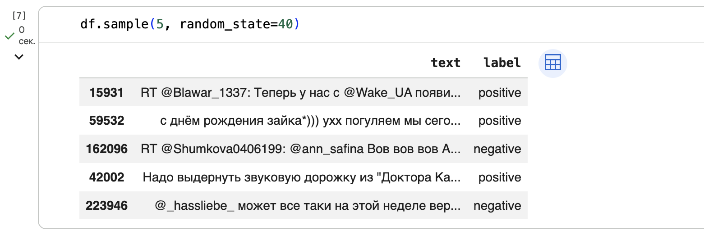

# Лабораторная работа 7: *Анализ текста*

## Цели

1. Изучить основные этапы предобработки текстовых данных для задач машинного обучения.
2. Освоить методы векторизации текста с использованием `CountVectorizer` и `TfidfVectorizer`.
3. Рассмотреть влияние токенизации, стоп-слов, пунктуации и n-грамм на качество классификации текста.
4. Построить модели для классификации твитов по тональности.
5. Сравнить качество нескольких алгоритмов классификации на задаче анализа тональности.

## Задачи

В рамках лабораторной работы требовалось:

- Сформировать общий датафрейм с текстами твитов и метками классов, разделить данные на обучающую и тестовую выборки
- Изучить принцип работы n-грамм
- Выполнить базовую векторизацию текста с помощью `CountVectorizer`
- Обучить модель `LogisticRegression` для классификации твитов
- Сравнить качество модели при использовании униграмм и триграмм
- Выполнить TF-IDF-векторизацию текста и сравнить результаты TF-IDF для униграмм, биграмм, триграмм и пентаграмм
- Применить токенизацию текста с помощью `word_tokenize`
- Изучить влияние стоп-слов и пунктуации на качество классификации
- Выполнить лемматизацию отдельных слов с помощью `pymorphy3`
- Сравнить `LogisticRegression` с двумя альтернативными алгоритмами классификации
- Оформить результаты `classification_report` в виде таблиц

## Ход работы

### 1. Описание задачи и набора данных

Необходимо было построить модель, которая по тексту сообщения определяет его класс.

В качестве исходных данных использовался корпус русскоязычных твитов RuTweetCorp. Данные были разделены на два CSV-файла.

В файлах хранится несколько столбцов с информацией о твитах, однако для выполнения задачи классификации использовался только столбец с текстом сообщения. Для каждого набора данных дополнительно был создан столбец label, содержащий метку класса:

```bash
positive = pd.read_csv(
    'positive.csv',
    sep=';',
    usecols=[3],
    names=['text']
)
positive['label'] = 'positive'
negative = pd.read_csv(
    'negative.csv',
    sep=';',
    usecols=[3],
    names=['text']
)
negative['label'] = 'negative'
df = pd.concat([positive, negative], ignore_index=True)
```

Структура итогового датафрейма:

| Столбец | Описание |
|---|---|
| `text` | текст твита |
| `label` | метка тональности: `positive` или `negative` |

После объединения положительных и отрицательных твитов данные были разделены на обучающую и тестовую выборки:

```bash
x_train, x_test, y_train, y_test = train_test_split(
    df.text,
    df.label,
    test_size=0.25,
    random_state=42,
    stratify=df.label
)
```

Параметр `stratify=df.label` использовался для сохранения одинакового соотношения положительных и отрицательных твитов в обучающей и тестовой выборках.

Результат разбиения:

| Выборка | Содержимое |
|---|---|
| `x_train` | тексты твитов для обучения |
| `x_test` | тексты твитов для тестирования |
| `y_train` | метки классов для обучающей выборки |
| `y_test` | метки классов для тестовой выборки |`

На этом этапе данные были подготовлены к векторизации и дальнейшему обучению моделей классификации.



### 2. Базовая классификация с использованием `CountVectorizer`

После подготовки данных был рассмотрен базовый способ представления текста в числовом виде — `CountVectorizer`.

Перед применением векторизатора был рассмотрен принцип работы n-грамм. Для демонстрации работы n-грамм использовалась функция ngrams из библиотеки `nltk`:

```bash
from nltk import ngrams
sentence = 'Если б мне платили каждый раз'.split()
list(ngrams(sentence, 1))
list(ngrams(sentence, 2))
list(ngrams(sentence, 3))
```

На первом этапе в качестве признаков использовались униграммы, то есть отдельные слова. Для этого был создан объект `CountVectorizer` с параметром `ngram_range=(1, 1)`:

```bash
from sklearn.linear_model import LogisticRegression
from sklearn.feature_extraction.text import CountVectorizer
vectorizer = CountVectorizer(ngram_range=(1, 1))
vectorized_x_train = vectorizer.fit_transform(x_train)
```

После векторизации была обучена модель логистической регрессии:

```bash
clf = LogisticRegression(random_state=42, max_iter=1000)
clf.fit(vectorized_x_train, y_train)
```

Для тестовой выборки использовался метод `transform()`, так как словарь признаков уже был построен на обучающих данных:

```bash
vectorized_x_test = vectorizer.transform(x_test)
pred = clf.predict(vectorized_x_test)
print(classification_report(y_test, pred))
```

В результате была получена базовая модель классификации, которая использует частоты отдельных слов в твитах.

Далее был проведен аналогичный эксперимент с триграммами. В этом случае признаками стали последовательности из трех подряд идущих слов:

```bash
vectorizer_3 = CountVectorizer(ngram_range=(3, 3))
vectorized_x_train_3 = vectorizer_3.fit_transform(x_train)
clf_3 = LogisticRegression(random_state=42, max_iter=1000)
clf_3.fit(vectorized_x_train_3, y_train)
vectorized_x_test_3 = vectorizer_3.transform(x_test)
pred_3 = clf_3.predict(vectorized_x_test_3)
print(classification_report(y_test, pred_3))
```

Результат для униграмм:

| Класс | Precision | Recall | F1-score | Support |
|---|---:|---:|---:|---:|
| `negative` | 0.76 | 0.77 | 0.76 | 27937 |
| `positive` | 0.77 | 0.76 | 0.77 | 28772 |
| **accuracy** |  |  | **0.76** | 56709 |
| **macro avg** | 0.76 | 0.76 | 0.76 | 56709 |
| **weighted avg** | 0.76 | 0.76 | 0.76 | 56709 |

Результат для триграмм:

| Класс | Precision | Recall | F1-score | Support |
|---|---:|---:|---:|---:|
| `negative` | 0.57 | 0.85 | 0.68 | 27937 |
| `positive` | 0.72 | 0.38 | 0.50 | 28772 |
| **accuracy** |  |  | **0.61** | 56709 |
| **macro avg** | 0.65 | 0.62 | 0.59 | 56709 |
| **weighted avg** | 0.65 | 0.61 | 0.59 | 56709 |

По результатам эксперимента триграммы показали более низкое качество по сравнению с униграммами. Это объясняется тем, что конкретные последовательности из трех слов редко совпадают между обучающей и тестовой выборками, особенно в коротких и неформальных текстах вроде твитов.

### 3. TF-IDF-векторизация текста

После базовой векторизации с помощью `CountVectorizer` была рассмотрена TF-IDF-векторизация. TF-IDF учитывает не только частоту слова в конкретном тексте, но и то, насколько редко оно встречается во всем корпусе.

Для работы использовался `TfidfVectorizer` из библиотеки `sklearn`:

```bash
from sklearn.feature_extraction.text import TfidfVectorizer
```

Сначала была построена модель на униграммах:

```bash
tfidfvectorizer_1 = TfidfVectorizer(ngram_range=(1, 1))
tfidf_vectorized_x_train_1 = tfidfvectorizer_1.fit_transform(x_train)
clf_tfidf_1 = LogisticRegression(random_state=42, max_iter=1000)
clf_tfidf_1.fit(tfidf_vectorized_x_train_1, y_train)
tfidf_vectorized_x_test_1 = tfidfvectorizer_1.transform(x_test)
pred_tfidf_1 = clf_tfidf_1.predict(tfidf_vectorized_x_test_1)
print(classification_report(y_test, pred_tfidf_1))
```

Далее по аналогии были рассчитаны результаты для биграмм, триграмм и пентаграмм. Это позволило сравнить, как длина n-грамм влияет на качество классификации.

| Тип признаков | `ngram_range` | Описание |
|---|---|---|
| Униграммы | `(1, 1)` | отдельные слова |
| Биграммы | `(2, 2)` | пары слов |
| Триграммы | `(3, 3)` | последовательности из трех слов |
| Пентаграммы | `(5, 5)` | последовательности из пяти слов |

### 4. Токенизация, стоп-слова и пунктуация

Следующим этапом была рассмотрена более точная предобработка текста: токенизация, удаление стоп-слов и работа с пунктуацией.

В работе использовался токенизатор `word_tokenize` из библиотеки `nltk`:

```bash
import nltk
from nltk.tokenize import word_tokenize
nltk.download('punkt_tab')
nltk.download('stopwords')
```

Для удаления неинформативных слов были использованы русские стоп-слова из `nltk`, а также знаки пунктуации из модуля `string`:

```bash
from nltk.corpus import stopwords
from string import punctuation
noise = stopwords.words('russian') + list(punctuation)
```

После этого был создан векторизатор, который использует токенизацию и исключает стоп-слова:

```bash
smart_tokenizer = CountVectorizer(
    ngram_range=(1, 1),
    tokenizer=word_tokenize,
    token_pattern=None,
    stop_words=noise
)
smart_vectorized_x_train = smart_tokenizer.fit_transform(x_train)
clf_smart = LogisticRegression(random_state=42, max_iter=1000)
clf_smart.fit(smart_vectorized_x_train, y_train)
smart_vectorized_x_test = smart_tokenizer.transform(x_test)
pred_smart = clf_smart.predict(smart_vectorized_x_test)
print(classification_report(y_test, pred_smart))
```

Такой подход позволяет уменьшить количество шумовых признаков: из текста убираются частые служебные слова и отдельные знаки пунктуации.

Далее был выполнен отдельный эксперимент, в котором пунктуация и стоп-слова не удалялись. Векторизатор использовал `word_tokenize`, но параметр `stop_words` не задавался:

```bash
punct_vectorizer = CountVectorizer(
    ngram_range=(1, 1),
    tokenizer=word_tokenize,
    token_pattern=None
)
punct_vectorized_x_train = punct_vectorizer.fit_transform(x_train)
clf_punct = LogisticRegression(random_state=42, max_iter=1000)
clf_punct.fit(punct_vectorized_x_train, y_train)
punct_vectorized_x_test = punct_vectorizer.transform(x_test)
pred_punct = clf_punct.predict(punct_vectorized_x_test)
print(classification_report(y_test, pred_punct))
```

Результат оказался значительно выше, чем у базовой модели, потому что в твитах пунктуация и смайлики часто несут информацию о тональности.

### 5. Лемматизация и символьные n-граммы

После экспериментов с токенизацией была рассмотрена лемматизация — приведение слов к начальной форме.

Для лемматизации использовалась библиотека `pymorphy3`:

```bash
!pip install pymorphy3
from pymorphy3 import MorphAnalyzer
pymorphy3_analyzer = MorphAnalyzer()
```

Работа анализатора была проверена на отдельном слове:

```bash
sent = ['Если', 'б', 'мне', 'платили', 'каждый', 'раз']
ana = pymorphy3_analyzer.parse(sent[3])
ana[0].normal_form
```

Результат:

| Исходное слово | Начальная форма |
|---|---|
| `платили` | `платить` |

Далее были рассмотрены символьные n-граммы. Для этого в `CountVectorizer` использовался параметр `analyzer='char'`:

```bash
char_vectorizer = CountVectorizer(
    analyzer='char',
    ngram_range=(1, 1)
)
char_vectorized_x_train = char_vectorizer.fit_transform(x_train)
clf_char = LogisticRegression(random_state=42, max_iter=1000)
clf_char.fit(char_vectorized_x_train, y_train)
char_vectorized_x_test = char_vectorizer.transform(x_test)
pred_char = clf_char.predict(char_vectorized_x_test)
print(classification_report(y_test, pred_char))
```

Символьные признаки оказались полезными для данной задачи, потому что они позволяют модели учитывать отдельные символы из смайликов и пунктуации.

### 6. Самостоятельная работа

1) Сравнение моделей классификации

В самостоятельной части лабораторной работы требовалось сравнить качество модели `LogisticRegression` с двумя альтернативными алгоритмами классификации. Для сравнения были выбраны:

* `LogisticRegression` — базовая линейная модель
* `XGBClassifier` — модель градиентного бустинга
* `LinearSVC` — линейный метод опорных векторов

Для всех моделей использовались одинаковые признаки, полученные с помощью `CountVectorizer` с токенизацией через `word_tokenize`.

!!! note "Примечание"
    Чтобы сравнение моделей было корректным, менялся только алгоритм классификации. Способ векторизации текста оставался одинаковым для всех моделей.

Сначала была обучена модель `LogisticRegression`:

```bash
sr_vectorizer = CountVectorizer(
    ngram_range=(1, 1),
    tokenizer=word_tokenize,
    token_pattern=None
)
sr_x_train = sr_vectorizer.fit_transform(x_train)
sr_x_test = sr_vectorizer.transform(x_test)
lr_model = LogisticRegression(random_state=42, max_iter=1000)
lr_model.fit(sr_x_train, y_train)
lr_pred = lr_model.predict(sr_x_test)
print(classification_report(y_test, lr_pred))
```

Далее был применен `XGBClassifier`. Так как эта модель работает с числовыми метками классов, значения `negative` и `positive` были преобразованы в 0 и 1:

```bash
y_train_binary = y_train.map({
    'negative': 0,
    'positive': 1
})
y_test_binary = y_test.map({
    'negative': 0,
    'positive': 1
})
```

Для `XGBClassifier` были использованы параметры, указанные в задании:

```bash
xgb_model = XGBClassifier(
    learning_rate=0.1,
    n_estimators=1000,
    max_depth=5,
    min_child_weight=3,
    gamma=0.2,
    subsample=0.6,
    colsample_bytree=1.0,
    objective='binary:logistic',
    nthread=4,
    scale_pos_weight=1,
    seed=27,
    eval_metric='logloss'
)
xgb_model.fit(sr_x_train, y_train_binary)
xgb_pred_binary = xgb_model.predict(sr_x_test)
print(classification_report(
    y_test_binary,
    xgb_pred_binary,
    target_names=['negative', 'positive']
))
```

В качестве второго альтернативного алгоритма был выбран `LinearSVC`:

```bash
from sklearn.svm import LinearSVC
svc_model = LinearSVC(random_state=42, max_iter=5000)
svc_model.fit(sr_x_train, y_train)
svc_pred = svc_model.predict(sr_x_test)
print(classification_report(y_test, svc_pred))
```

??? info "Примечание"
    LinearSVC хорошо подходит для задач текстовой классификации, потому что эффективно работает с большим количеством разреженных признаков. После векторизации текста получается матрица большой размерности, и линейные модели обычно хорошо справляются с такими данными.

Для итогового сравнения были использованы метрики `precision`, `recall`, `f1-score` и `accuracy`, полученные с помощью `classification_report`.

Итоговая сравнительная таблица:

| Модель | Accuracy | Negative Precision | Negative Recall | Negative F1 | Positive Precision | Positive Recall | Positive F1 | Macro F1 | Weighted F1 |
|---|---:|---:|---:|---:|---:|---:|---:|---:|---:|
| `LogisticRegression` | 0.998625 | 0.998711 | 0.998497 | 0.998604 | 0.998541 | 0.998749 | 0.998645 | 0.998624 | 0.998625 |
| `XGBClassifier` | 0.998660 | 0.998568 | 0.998711 | 0.998640 | 0.998749 | 0.998610 | 0.998679 | 0.998660 | 0.998660 |
| `LinearSVC` | 0.998783 | 0.998712 | 0.998819 | 0.998765 | 0.998853 | 0.998749 | 0.998801 | 0.998783 | 0.998783 |

По результатам сравнения все три модели показали очень высокое качество: `accuracy` выше 0.998. Лучший результат получил `LinearSVC`: `accuracy`, `macro f1-score` и `weighted f1-score` составили 0.998783.

`XGBClassifier` немного превзошел `LogisticRegression`, но разница между моделями минимальна. Почти идеальные метрики связаны с тем, что при векторизации сохранялись пунктуация и смайлики — сильные признаки тональности в данном датасете.

2) Сравнение TF-IDF для разных n-грамм

Во второй части самостоятельной работы требовалось сравнить качество `LogisticRegression` при использовании TF-IDF-векторизации для разных n-грамм: униграмм, биграмм, триграмм и пентаграмм.

Для этого была создана функция, которая обучает `TfidfVectorizer`, применяет логистическую регрессию и выводит `classification_report`:

```bash
def train_tfidf_logreg(ngram_range, model_name):
    vectorizer = TfidfVectorizer(ngram_range=ngram_range)
    
    x_train_tfidf = vectorizer.fit_transform(x_train)
    x_test_tfidf = vectorizer.transform(x_test)
    
    model = LogisticRegression(random_state=42, max_iter=1000)
    model.fit(x_train_tfidf, y_train)
    
    pred = model.predict(x_test_tfidf)
    
    print(f'Результаты для {model_name}')
    print(classification_report(y_test, pred))
    
    return get_metrics_table(y_test, pred, model_name)
```

Затем были обучены модели для четырех вариантов признаков:

```bash
tfidf_results = []
tfidf_results.append(train_tfidf_logreg((1, 1), 'TF-IDF unigrams'))
tfidf_results.append(train_tfidf_logreg((2, 2), 'TF-IDF bigrams'))
tfidf_results.append(train_tfidf_logreg((3, 3), 'TF-IDF trigrams'))
tfidf_results.append(train_tfidf_logreg((5, 5), 'TF-IDF pentagrams'))
tfidf_results_table = pd.concat(tfidf_results, ignore_index=True)
tfidf_results_table
```

Результаты сравнения:

| Модель | Accuracy | Negative Precision | Negative Recall | Negative F1 | Positive Precision | Positive Recall | Positive F1 | Macro F1 | Weighted F1 |
|---|---:|---:|---:|---:|---:|---:|---:|---:|---:|
| `TF-IDF unigrams` | 0.7588 | 0.7650 | 0.7366 | 0.7506 | 0.7532 | 0.7803 | 0.7665 | 0.7585 | 0.7586 |
| `TF-IDF bigrams` | 0.7131 | 0.7237 | 0.6754 | 0.6988 | 0.7040 | 0.7497 | 0.7261 | 0.7124 | 0.7126 |
| `TF-IDF trigrams` | 0.6466 | 0.7227 | 0.4587 | 0.5612 | 0.6120 | 0.8291 | 0.7042 | 0.6327 | 0.6338 |
| `TF-IDF pentagrams` | 0.5597 | 0.9538 | 0.1116 | 0.1998 | 0.5356 | 0.9948 | 0.6963 | 0.4480 | 0.4517 |

Лучшее качество показала TF-IDF-векторизация на униграммах: `accuracy` составила 0.7588, `macro f1-score` — 0.7585. При использовании биграмм качество снизилось до `accuracy` 0.7131, а триграммы дали еще более низкий результат — 0.6466.

Худший результат показали пентаграммы: `accuracy` составила 0.5597, `macro f1-score` — 0.4480. Это связано с тем, что длинные n-граммы редко повторяются между обучающей и тестовой выборками, поэтому признаки становятся слишком разреженными.

## Выводы

В ходе лабораторной работы были изучены основные методы анализа и предобработки текстовых данных для задачи классификации твитов по тональности. Были загружены положительные и отрицательные твиты, сформирован общий датафрейм, выполнено разбиение на обучающую и тестовую выборки, а затем применены разные способы векторизации текста.

Базовая модель `LogisticRegression` с `CountVectorizer` на униграммах показала более устойчивый результат, чем модель на триграммах. Это связано с тем, что отдельные слова чаще повторяются в коротких текстах, а длинные n-граммы делают пространство признаков более разреженным.

В самостоятельной части были сравнены `LogisticRegression`, `XGBClassifier` и `LinearSVC`. Лучший результат показал `LinearSVC`: `accuracy`, `macro f1-score` и `weighted f1-score` составили 0.998783. Также было выявлено, что среди TF-IDF-признаков лучше всего сработали униграммы: `accuracy` 0.7588, `macro f1-score` 0.7585.

Отдельно было показано, что пунктуация и смайлики не всегда являются шумом. В задаче анализа тональности они могут быть важными признаками, так как напрямую выражают эмоциональную окраску сообщения. В результате работы были получены навыки подготовки текстовых данных, векторизации и оценки качества моделей классификации.

**Cсылка на доску Colab:**

[Доска Colab](https://colab.research.google.com/drive/1ALCryhXV_C7Q0XyGIAa9djpwIjYMC9fx?usp=sharing)