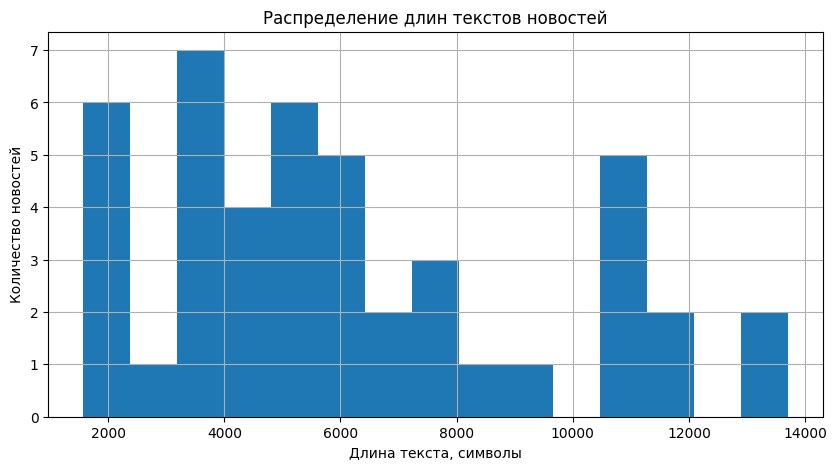
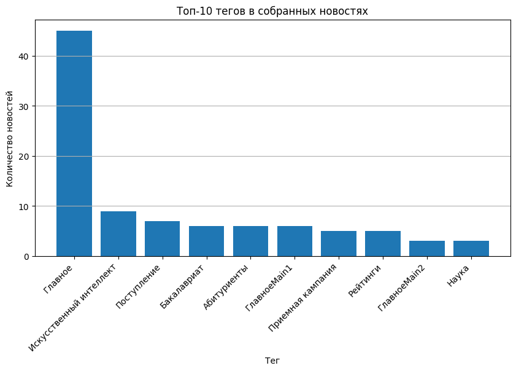

# Лабораторная работа 8: *Скрапинг и анализ текста*

## Цели

1. Освоить базовые методы веб-скрапинга с использованием `Python`
2. Собрать датасет новостей с сайта **ITMO.NEWS**
4. Получить подробную информацию по каждой новости: текст, дату, просмотры, теги и ссылку
5. Сохранить собранные данные в CSV-файлы для дальнейшего анализа
6. Выполнить первичный анализ текстовых данных

## Задачи

В рамках лабораторной работы требовалось:

- Спарсить общий список новостей с сайта **ITMO.NEWS**
- Для каждой новости из общего списка получить:
    * идентификатор новости
    * название новости
    * дату размещения
    * URL страницы новости
- Для каждой страницы конкретной новости дополнительно спарсить:
    * идентификатор новости
    * название
    * дату размещения
    * количество просмотров
    * полный текст новости
    * теги
- Сохранить общий список новостей в CSV-файл
- Сохранить подробные данные по новостям в CSV-файл в папке `news_content`
- Провести базовый анализ текстов и тегов

## Ход работы

### 1. Описание источника данных и структуры датасета

В качестве источника данных использовался сайт ITMO.NEWS. Для скрапинга был выбран [раздел с главными новостями](https://news.itmo.ru/ru/main_news/).

Структура общего датасета:

| Столбец | Описание |
|---|---|
| `id` | целочисленный идентификатор новости, извлеченный из URL |
| `title` | название новости |
| `date` | дата размещения новости |
| `url` | ссылка на страницу конкретной новости |

На странице конкретной новости собирались подробные данные: количество просмотров, полный текст и теги.

Структура подробного датасета:

| Столбец | Описание |
|---|---|
| `id` | целочисленный идентификатор новости |
| `title` | название новости |
| `date` | дата размещения новости |
| `views` | количество просмотров новости |
| `text` | полный текст новости |
| `tags` | список тегов новости |
| `url` | ссылка на страницу новости |

Для хранения результатов были предусмотрены два CSV-файла:

| Файл | Содержимое |
|---|---|
| `news_general.csv` | общий список новостей с идентификаторами, названиями, датами и URL |
| `news_content/news_content.csv` | подробные данные по каждой новости: текст, просмотры, теги и метаданные |

Для работы были импортированы библиотеки `requests`, `BeautifulSoup`, `pandas`, `re`, `os`, `time` и `matplotlib`:

```bash
import os
import re
import time
import requests
import pandas as pd
import matplotlib.pyplot as plt
from bs4 import BeautifulSoup
from urllib.parse import urljoin
```

Основные константы проекта:

```bash
DOMAIN = "https://news.itmo.ru"
MAIN_NEWS_URL = "https://news.itmo.ru/ru/main_news/"
OUTPUT_DIR = "news_content"
GENERAL_CSV = "news_general.csv"
CONTENT_CSV = os.path.join(OUTPUT_DIR, "news_content.csv")
os.makedirs(OUTPUT_DIR, exist_ok=True)
```

### 2. Сбор общего списка новостей

На первом этапе был реализован сбор общего списка новостей из раздела `main_news`. Для загрузки страницы использовалась функция `get_soup()`, которая отправляет GET-запрос и преобразует HTML-код страницы в объект `BeautifulSoup`:

```bash
def get_soup(url):
    """Загружает страницу и возвращает объект BeautifulSoup."""
    response = requests.get(url)
    response.raise_for_status()
    return BeautifulSoup(response.text, "html.parser")
```

Идентификатор новости извлекался из URL с помощью регулярного выражения:

```bash
def extract_news_id(url):
    """Извлекает целочисленный идентификатор новости из URL."""
    match = re.search(r"/news/(\d+)/", url)
    if match:
        return int(match.group(1))
    return None
```

Так как ссылки на новости могут относиться к разным разделам сайта, использовалось регулярное выражение, которое учитывает несколько вариантов URL:

```bash
links = soup.find_all(
    "a",
    href=re.compile(r"/ru/.*/news/\d+/|/ru/news/\d+/")
)
```

Для каждой найденной ссылки сохранялись ID новости, заголовок, дата размещения и полный URL. Чтобы не сохранять одну и ту же новость несколько раз, дополнительно выполнялось удаление дублей по идентификатору:

```bash
unique_items = {}
for item in news_items:
    unique_items[item["id"]] = item
return list(unique_items.values()), next_url
```

После этого была создана функция `collect_news_list()`, которая проходит несколько страниц раздела с новостями и собирает данные в один датафрейм:

```bash
news_general_df = collect_news_list(
    MAIN_NEWS_URL,
    max_pages=5,
    delay=1
)
news_general_df.head()
```

В результате было собрано 45 новостей. Общий список был сохранен в файл `news_general.csv`:

```bash
news_general_df.to_csv(
    GENERAL_CSV,
    index=False,
    encoding="utf-8-sig"
)
print(f"Файл сохранен: {GENERAL_CSV}")
print(f"Количество новостей: {len(news_general_df)}")
```

Результат выполнения:

| Показатель | Значение |
|---|---:|
| Количество обработанных страниц | 5 |
| Количество собранных новостей | 45 |
| Файл с общим списком | `news_general.csv` |

Был получен базовый датасет, который дальше использовался для перехода на страницы конкретных новостей.

### 3. Парсинг страниц конкретных новостей

После получения общего списка новостей был выполнен переход на страницы конкретных новостей. На этом этапе для каждой новости собирались подробные данные: дата, количество просмотров, полный текст и теги.

Для парсинга одной страницы была создана функция `parse_news_page()`. Сначала из страницы извлекались идентификатор и заголовок новости:

```bash
news_id = extract_news_id(url)
title = ""
title_tag = soup.find("h1")
if title_tag:
    title = clean_text(title_tag.get_text())
if not title and soup.title:
    title = clean_text(soup.title.get_text())
```

Дата размещения искалась в полном тексте страницы с помощью регулярного выражения:

```bash
date_match = re.search(
    r"\d{1,2}\s+[А-Яа-яЁё]+\s+\d{4}",
    page_text
)
if date_match:
    date = date_match.group(0)
```

Для извлечения просмотров использовался отдельный шаблон, который учитывает строку вида 14 Апреля 2026, 16:27 UTC+3 28508:

```bash
views_patterns = [
    r"\d{1,2}\s+[А-Яа-яЁё]+\s+\d{4},\s*\d{1,2}:\d{2}\s*UTC[+-]\d+\s+(\d+)",
    r"Просмотров[:\s]+(\d+)",
    r"Просмотры[:\s]+(\d+)",
    r"(\d+)\s+просмотров",
    r"(\d+)\s+просмотр(?:ов|а)?",
    r"views?[:\s]+(\d+)"
]
for pattern in views_patterns:
    views_match = re.search(pattern, page_text, flags=re.IGNORECASE)
    if views_match:
        views = int(views_match.group(1))
        break
```

Для извлечения текста использовалось несколько возможных CSS-селекторов. Из найденных блоков выбирался наиболее подходящий по объему текста, а повторяющиеся фрагменты удалялись:

```bash
selectors = [
    "div.news-page__content",
    "div.news-detail__content",
    "div.article__content",
    "div.content-text",
    "div.news-content",
    "div.article-content",
    "div.text",
    "article"
]
```

Теги извлекались из ссылок, ведущих на страницы поиска или тегов. Дополнительно выполнялась очистка служебных значений, например `Bottom`:

```bash
tag_links = soup.find_all(
    "a",
    href=re.compile(r"/ru/search/|/ru/tag/|/ru/tags/")
)
for tag in tag_links:
    tag_text = clean_text(tag.get_text())
    if "Bottom" in tag_text:
        tag_text = tag_text.replace("Bottom", "")
    if tag_text and tag_text not in tags:
        tags.append(tag_text)
```

Работа функции была проверена на одной новости:

| Поле | Пример результата |
|---|---|
| `id` | `14258` |
| `title` | `Яндекс, Сбер, VK и не только: магистратуры ИТМО, которые поддерживают крупные компании` |
| `date` | `14 Апреля 2026` |
| `views` | `28508` |
| `tags` | `Магистратура, Поступление, Партнерство, Главное, Абитуриенты, Образовательные программы` |
| `text_length` | `11917` |

Также была выполнена проверка на повторы в тексте:

| Показатель | Значение |
|---|---:|
| Всего абзацев | 47 |
| Уникальных абзацев | 47 |
| Повторов | 0 |

После проверки одной новости функция была применена ко всему общему датасету. Для этого использовалась функция `collect_news_content()`:

```bash
news_content_df = collect_news_content(
    news_general_df,
    delay=1
)
news_content_df.head()
```

В результате был сформирован подробный датасет с текстами новостей, тегами и просмотрами.

### 4. Сохранение и проверка собранных данных

После парсинга страниц конкретных новостей подробный датасет был сохранен в CSV-файл. Для корректного отображения русскоязычного текста использовалась кодировка `utf-8-sig`:

```bash
news_content_df.to_csv(
    CONTENT_CSV,
    index=False,
    encoding="utf-8-sig"
)
print(f"Файл сохранен: {CONTENT_CSV}")
print(f"Количество новостей: {len(news_content_df)}")
```

Результат контрольной проверки созданных файлов:

| Показатель | Значение |
|---|---:|
| Общий CSV создан | `True` |
| Подробный CSV создан | `True` |
| Количество новостей в общем датасете | 45 |
| Количество новостей в подробном датасете | 45 |
| Новостей без текста | 0 |
| Новостей без даты | 0 |
| Новостей без просмотров | 0 |

### 5. Первичный анализ собранных данных

После сохранения датасета был выполнен небольшой анализ собранных текстов. Для этого в подробный датафрейм был добавлен столбец `text_length`, в котором хранится длина текста новости в символах:

```bash
news_content_df["text_length"] = news_content_df["text"].str.len()
text_stats = news_content_df["text_length"].describe()
text_stats
```

По рассчитанной статистике можно оценить общий объем собранных текстов: минимальную, максимальную и среднюю длину новостей:

| Показатель | Значение |
|---|---:|
| Количество новостей | 45 |
| Средняя длина текста | 3806.36 |
| Минимальная длина текста | 509 |
| Максимальная длина текста | 11917 |

Далее было построено распределение длин текстов. По графику видно, что большинство новостей имеют небольшой или средний объем, а очень длинных материалов в датасете меньше:



После анализа длины текстов были обработаны теги новостей. Так как в одном поле `tags` хранится несколько тегов через запятую, они были разделены и преобразованы в отдельную таблицу:

```bash
all_tags = []
for tags in news_content_df["tags"].dropna():
    for tag in str(tags).split(","):
        tag = clean_text(tag)
        if tag:
            all_tags.append(tag)
tags_df = pd.DataFrame(all_tags, columns=["tag"])
top_tags_df = tags_df["tag"].value_counts().reset_index()
top_tags_df.columns = ["tag", "count"]
top_tags_df.head(15)
```

| Тег | Количество |
|---|---:|
| `Главное` | 44 |
| `Образование` | 10 |
| `Наука` | 9 |
| `Поступление` | 7 |
| `Абитуриенты` | 6 |
| `Студенты` | 5 |
| `Магистратура` | 4 |
| `Партнерство` | 4 |
| `Международное сотрудничество` | 4 |
| `Искусственный интеллект` | 3 |

Для наглядности был построен график топ-10 тегов:



## Выводы

В ходе лабораторной работы был выполнен скрапинг сайта **ITMO.NEWS**. Сначала был собран общий список новостей с идентификаторами, названиями, датами и URL, затем для каждой новости были получены подробные данные: количество просмотров, полный текст и теги. Итоговые данные были сохранены в два CSV-файла: `news_general.csv` и `news_content/news_content.csv`.

Также была выполнена проверка качества собранного датасета: все 45 новостей содержат дату, текст и количество просмотров. Дополнительно был проведен первичный анализ текстов: рассчитана длина новостей, построено распределение длин текстов и определены наиболее частые теги. В результате были получены навыки загрузки HTML-страниц, извлечения данных из разной верстки и сохранения структурированных данных для дальнейшего анализа.

**Ссылка на доску Colab:**

[Доска Colab](https://colab.research.google.com/drive/1XkaoNSggeuGAVJd_g3lJs6-shsEPez_l?usp=sharing)