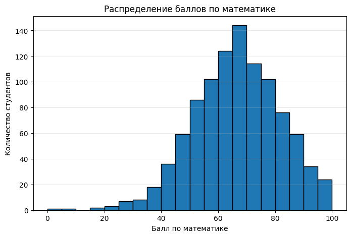
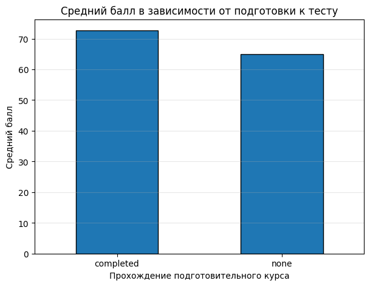
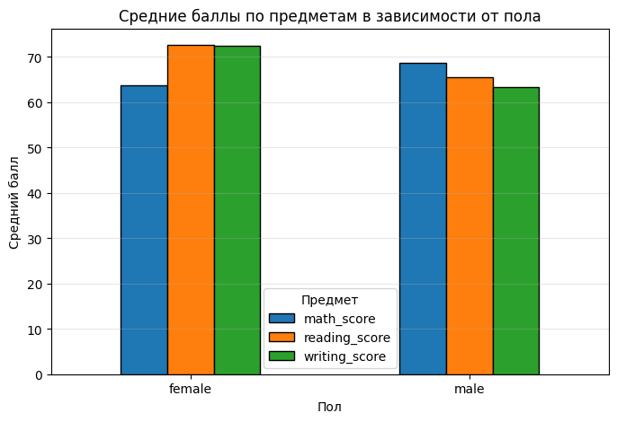
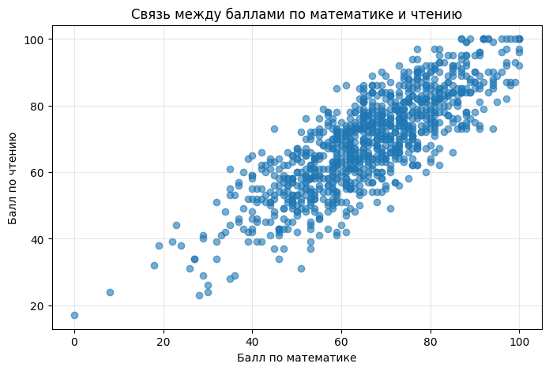
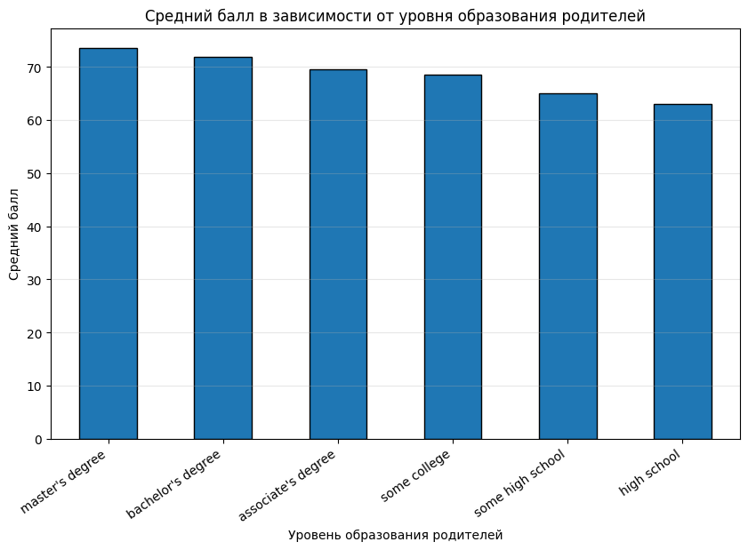
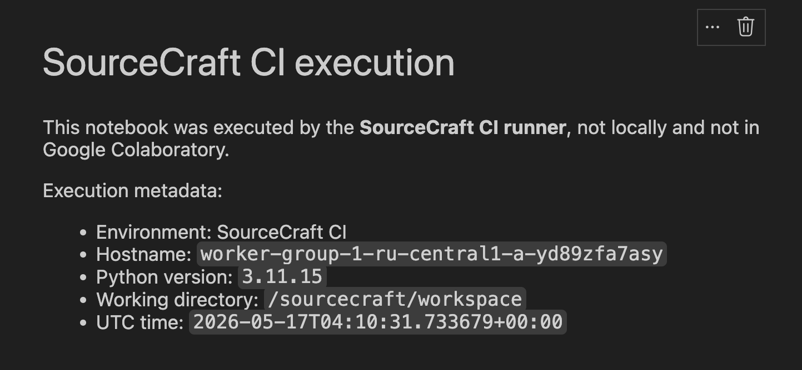

# Лабораторная работа 9: *Работа с графикой. Sourcecraft. CI/CD. Артефакты*

## Цели

1. Освоить базовые приемы анализа табличных данных с использованием `pandas`.
2. Научиться выполнять первичную обработку датасета: загрузку, проверку структуры, поиск пропусков и переименование столбцов.
3. Создать новые признаки на основе исходных данных.
4. Выполнить группировку и агрегацию данных для поиска закономерностей.
5. Построить визуализации с помощью `matplotlib`.
6. Настроить CI в **SourceCraft** для автоматического выполнения ноутбука и генерации артефактов.

## Задачи

В рамках лабораторной работы требовалось:

- Сделать форк исходного репозитория на **SourceCraft**
- Заполнить пропуски в `ipynb`-файле с заданием
- Загрузить и обработать датасет `StudentsPerformance.csv`
- Рассчитать описательные статистики по числовым признакам и выполнить группировку данных
- Построить обязательные графики:
    * гистограмму распределения баллов по математике
    * столбчатую диаграмму среднего балла по подготовке к тесту
    * столбчатую диаграмму средних баллов по полу
    * диаграмму рассеяния для баллов по математике и чтению
- Построить дополнительную визуализацию
- Дополнить CI так, чтобы **SourceCraft**-раннер выполнял ноутбук и добавлял в артефакт текст, подтверждающий выполнение именно в CI-среде

## Ход работы

### 1. Загрузка и первичный просмотр данных

В качестве исходных данных использовался датасет `StudentsPerformance.csv`, содержащий информацию об успеваемости студентов. В таблице представлены оценки по математике, чтению и письму, а также несколько категориальных признаков: пол, группа, уровень образования родителей, тип обеда и прохождение подготовительного курса.

Для работы были импортированы библиотеки `pandas` и `matplotlib`:

```bash
import pandas as pd
import matplotlib.pyplot as plt
```

Датасет был загружен из файла `data/StudentsPerformance.csv`:

```bash
df = pd.read_csv("data/StudentsPerformance.csv")
display(df.head())
print("Размер таблицы:", df.shape)
```

Размер исходного датасета:

| Показатель | Значение |
|---|---:|
| Количество строк | 1000 |
| Количество столбцов | 8 |

Структура исходного датасета:

| Столбец | Описание |
|---|---|
| `gender` | пол студента |
| `race/ethnicity` | группа студента |
| `parental level of education` | уровень образования родителей |
| `lunch` | тип обеда |
| `test preparation course` | прохождение подготовительного курса |
| `math score` | балл по математике |
| `reading score` | балл по чтению |
| `writing score` | балл по письму |

После загрузки были выведены первые строки таблицы, названия столбцов, типы данных и общая информация о датафрейме:

```bash
print("Названия столбцов:")
print(df.columns.tolist())
print("\nТипы данных:")
print(df.dtypes)
print("\nИнформация о таблице:")
df.info()
```


### 2. Проверка пропусков и подготовка столбцов

После первичного просмотра была выполнена проверка пропущенных значений:

```bash
missing_values = df.isna().sum()
print("Количество пропущенных значений по столбцам:")
print(missing_values)
print("\nОбщее количество пропусков:", missing_values.sum())
```

Результат проверки:

| Столбец | Количество пропусков |
|---|---:|
| `gender` | 0 |
| `race/ethnicity` | 0 |
| `parental level of education` | 0 |
| `lunch` | 0 |
| `test preparation course` | 0 |
| `math score` | 0 |
| `reading score` | 0 |
| `writing score` | 0 |

Пропущенные значения в датасете не обнаружены, поэтому удаление или заполнение пропусков не потребовалось.

Далее столбцы были переименованы:

```bash
df = df.rename(columns={
    "race/ethnicity": "race_ethnicity",
    "parental level of education": "parent_education",
    "test preparation course": "test_prep",
    "math score": "math_score",
    "reading score": "reading_score",
    "writing score": "writing_score"
})
print("Обновленные названия столбцов:")
print(df.columns.tolist())
```

Таблица переименования столбцов:

| Исходное название | Новое название |
|---|---|
| `race/ethnicity` | `race_ethnicity` |
| `parental level of education` | `parent_education` |
| `test preparation course` | `test_prep` |
| `math score` | `math_score` |
| `reading score` | `reading_score` |
| `writing score` | `writing_score` |

!!! note "Примечание"
    Столбцы gender и lunch не переименовывались, так как их названия уже были короткими и удобными для обращения в коде.

### 3. Создание новых признаков

После подготовки столбцов были созданы два новых признака: средний балл студента и категориальный уровень успеваемости:

```bash
df["average_score"] = df[["math_score", "reading_score", "writing_score"]].mean(axis=1)
df["score_level"] = pd.cut(
    df["average_score"],
    bins=[0, 60, 75, 90, 100],
    labels=["low", "medium", "high", "excellent"],
    include_lowest=True
)
display(df.head())
```

Созданные признаки:

| Признак | Описание |
|---|---|
| `average_score` | средний балл по математике, чтению и письму |
| `score_level` | категория успеваемости на основе среднего балла |

Категории признака `score_level`:

| Категория | Диапазон среднего балла |
|---|---|
| `low` | 0–60 |
| `medium` | 60–75 |
| `high` | 75–90 |
| `excellent` | 90–100 |

### 4. Описательная статистика и типы признаков

После создания новых признаков была рассчитана описательная статистика по числовым столбцам:

```bash
statistics = df.describe()
display(statistics)
```

Основные результаты описательной статистики:

| Показатель | `math_score` | `reading_score` | `writing_score` | `average_score` |
|---|---:|---:|---:|---:|
| count | 1000.00 | 1000.00 | 1000.00 | 1000.00 |
| mean | 66.09 | 69.17 | 68.05 | 67.77 |
| std | 15.16 | 14.60 | 15.20 | 14.26 |
| min | 0.00 | 17.00 | 10.00 | 9.00 |
| 25% | 57.00 | 59.00 | 57.75 | 58.33 |
| 50% | 66.00 | 70.00 | 69.00 | 68.33 |
| 75% | 77.00 | 79.00 | 79.00 | 77.67 |
| max | 100.00 | 100.00 | 100.00 | 100.00 |

Далее признаки были разделены на числовые и категориальные:

```bash
numeric_features = df.select_dtypes(include=["int64", "float64"]).columns.tolist()
categorical_features = df.select_dtypes(include=["object", "category"]).columns.tolist()
print("Числовые признаки:")
print(numeric_features)
print("\nКатегориальные признаки:")
print(categorical_features)
```

| Тип признаков | Столбцы |
|---|---|
| Числовые | `math_score`, `reading_score`, `writing_score`, `average_score` |
| Категориальные | `gender`, `race_ethnicity`, `parent_education`, `lunch`, `test_prep`, `score_level` |

### 5. Группировка данных и сравнение средних баллов

Далее были рассчитаны средние баллы для разных групп студентов:

```bash
scores_by_test_prep = df.groupby("test_prep")[["math_score", "reading_score", "writing_score", "average_score"]].mean()
scores_by_gender = df.groupby("gender")[["math_score", "reading_score", "writing_score", "average_score"]].mean()
scores_by_parent_education = df.groupby("parent_education")[["math_score", "reading_score", "writing_score", "average_score"]].mean()
print("Средние баллы по прохождению подготовительного курса:")
display(scores_by_test_prep)
print("Средние баллы по полу:")
display(scores_by_gender)
print("Средние баллы по уровню образования родителей:")
display(scores_by_parent_education)
```

Средние баллы по прохождению подготовительного курса:

| Подготовительный курс | `math_score` | `reading_score` | `writing_score` | `average_score` |
|---|---:|---:|---:|---:|
| `completed` | 69.70 | 73.89 | 74.42 | 72.67 |
| `none` | 64.08 | 66.53 | 64.50 | 65.04 |

Средние баллы по полу:

| Пол | `math_score` | `reading_score` | `writing_score` | `average_score` |
|---|---:|---:|---:|---:|
| `female` | 63.63 | 72.61 | 72.47 | 69.57 |
| `male` | 68.73 | 65.47 | 63.31 | 65.84 |

Средние баллы по уровню образования родителей:

| Уровень образования родителей | `math_score` | `reading_score` | `writing_score` | `average_score` |
|---|---:|---:|---:|---:|
| `associate's degree` | 67.88 | 70.93 | 69.90 | 69.57 |
| `bachelor's degree` | 69.39 | 73.00 | 73.38 | 71.92 |
| `high school` | 62.14 | 64.70 | 62.45 | 63.10 |
| `master's degree` | 69.75 | 75.37 | 75.68 | 73.60 |
| `some college` | 67.13 | 69.46 | 68.84 | 68.48 |
| `some high school` | 63.50 | 66.94 | 64.89 | 65.11 |

### 6. Визуализация распределения баллов по математике

Для наглядного анализа была построена гистограмма распределения баллов по математике:

```bash
plt.figure(figsize=(8, 5))
plt.hist(df["math_score"], bins=20, edgecolor="black")
plt.title("Распределение баллов по математике")
plt.xlabel("Балл по математике")
plt.ylabel("Количество студентов")
plt.grid(axis="y", alpha=0.3)
plt.show()
```



### 7. Влияние подготовительного курса на средний балл

Далее была построена столбчатая диаграмма, показывающая средний балл студентов в зависимости от прохождения подготовительного курса:

```bash
plt.figure(figsize=(7, 5))
scores_by_test_prep["average_score"].plot(kind="bar", edgecolor="black")
plt.title("Средний балл в зависимости от подготовки к тесту")
plt.xlabel("Прохождение подготовительного курса")
plt.ylabel("Средний балл")
plt.xticks(rotation=0)
plt.grid(axis="y", alpha=0.3)
plt.show()
```



### 8. Сравнение средних баллов по полу

Для сравнения результатов по предметам была построена столбчатая диаграмма средних баллов для групп `female` и `male`:

```bash
plt.figure(figsize=(7, 5))
scores_by_gender[["math_score", "reading_score", "writing_score"]].plot(
    kind="bar",
    figsize=(8, 5),
    edgecolor="black"
)
plt.title("Средние баллы по предметам в зависимости от пола")
plt.xlabel("Пол")
plt.ylabel("Средний балл")
plt.xticks(rotation=0)
plt.grid(axis="y", alpha=0.3)
plt.legend(title="Предмет")
plt.show()
```



### 9. Связь между баллами по математике и чтению

Для анализа связи между двумя числовыми признаками была построена диаграмма рассеяния. В ней каждая точка соответствует одному студенту:

```bash
plt.figure(figsize=(8, 5))
plt.scatter(df["math_score"], df["reading_score"], alpha=0.6)
plt.title("Связь между баллами по математике и чтению")
plt.xlabel("Балл по математике")
plt.ylabel("Балл по чтению")
plt.grid(alpha=0.3)
plt.show()
```



### 10. Дополнительная визуализация по уровню образования родителей

В качестве дополнительной визуализации была построена столбчатая диаграмма среднего балла в зависимости от уровня образования родителей. Для удобства значения были отсортированы по убыванию среднего балла:

```bash
plt.figure(figsize=(10, 6))
scores_by_parent_education_sorted = scores_by_parent_education.sort_values(
    by="average_score",
    ascending=False
)
scores_by_parent_education_sorted["average_score"].plot(
    kind="bar",
    edgecolor="black"
)
plt.title("Средний балл в зависимости от уровня образования родителей")
plt.xlabel("Уровень образования родителей")
plt.ylabel("Средний балл")
plt.xticks(rotation=35, ha="right")
plt.grid(axis="y", alpha=0.3)
plt.show()
```



### 11. Автоматическое выполнение ноутбука в SourceCraft CI

CI должен не только создавать артефакты, но и подтверждать, что ноутбук был выполнен именно раннером **SourceCraft**. Для этого был изменен файл .`sourcecraft/ci.yaml`.

В CI выполняются следующие действия:

| Этап | Описание |
|---|---|
| Установка зависимостей | Устанавливаются библиотеки из `requirements.txt` и пакет `nbformat` |
| Изменение ноутбука | В конец `lab_template.ipynb` добавляется markdown-ячейка с информацией о выполнении в SourceCraft CI |
| Выполнение ноутбука | Ноутбук запускается через `jupyter nbconvert` |
| Генерация HTML-отчета | Выполненный ноутбук конвертируется в `report.html` |
| Сохранение артефактов | В артефакты добавляются `executed_lab.ipynb` и `report.html` |

Основная часть CI:

```bash
script:
  - python -m pip install --upgrade pip
  - pip install -r requirements.txt nbformat
  - |
    python - <<'PY'
    import nbformat
    import os
    import platform
    from datetime import datetime, timezone
    notebook_path = "lab_template.ipynb"
    with open(notebook_path, "r", encoding="utf-8") as file:
        notebook = nbformat.read(file, as_version=4)
    runner_info = f"""
    ## SourceCraft CI execution
    This notebook was executed by the **SourceCraft CI runner**, not locally and not in Google Colaboratory.
    Execution metadata:
    - Environment: SourceCraft CI
    - Hostname: `{platform.node()}`
    - Python version: `{platform.python_version()}`
    - Working directory: `{os.getcwd()}`
    - UTC time: `{datetime.now(timezone.utc).isoformat()}`
    """
    notebook.cells.append(nbformat.v4.new_markdown_cell(runner_info.strip()))
    with open(notebook_path, "w", encoding="utf-8") as file:
        nbformat.write(notebook, file)
    PY
  - jupyter nbconvert --to notebook --execute lab_template.ipynb --output executed_lab.ipynb
  - jupyter nbconvert --to html executed_lab.ipynb --output report.html
```

Результат работы CI:

| Артефакт | Назначение |
|---|---|
| `executed_lab.ipynb` | выполненный ноутбук с добавленной ячейкой SourceCraft CI |
| `report.html` | HTML-версия выполненного ноутбука |




## Выводы

В ходе лабораторной работы был выполнен анализ датасета `StudentsPerformance.csv`: данные были загружены, проверены, подготовлены к работе, а также дополнены признаками `average_score` и `score_level`.

С помощью `pandas` были рассчитаны статистики и выполнены группировки по подготовительному курсу, полу и уровню образования родителей. Анализ показал, что подготовительный курс связан с более высокими средними баллами, а результаты по предметам отличаются между группами `male` и `female``.

Также были построены графики для визуального анализа данных и настроен **SourceCraft CI**, который автоматически выполняет ноутбук, добавляет подтверждение выполнения в CI-среде и сохраняет артефакты `executed_lab.ipynb` и `report.html`.

**Ссылка на репозиторий:**

[Репозиторий с лабораторной работой](https://sourcecraft.dev/kiuyqu/itmo-python-lab-9?rev=main)